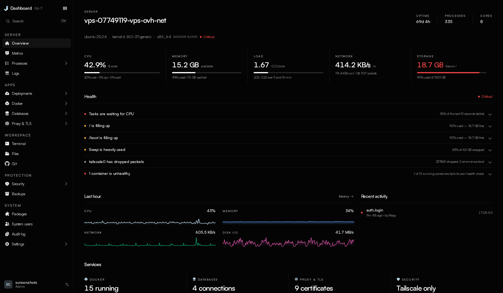
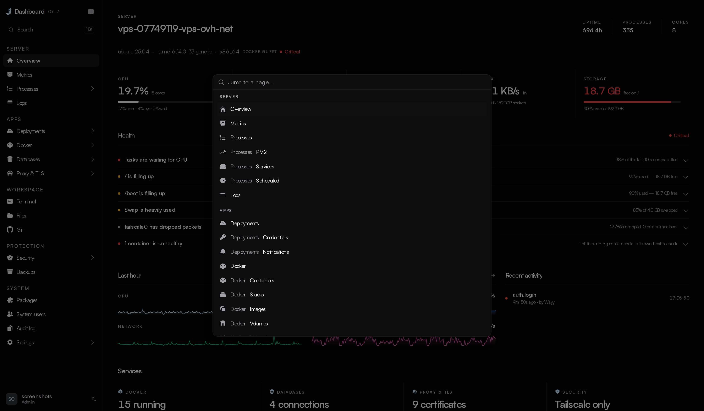
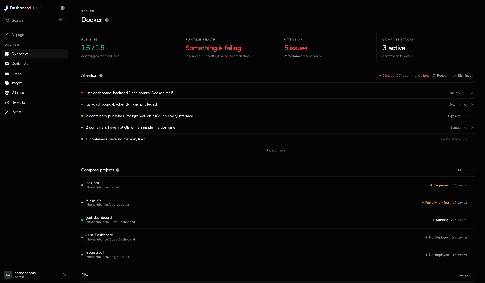
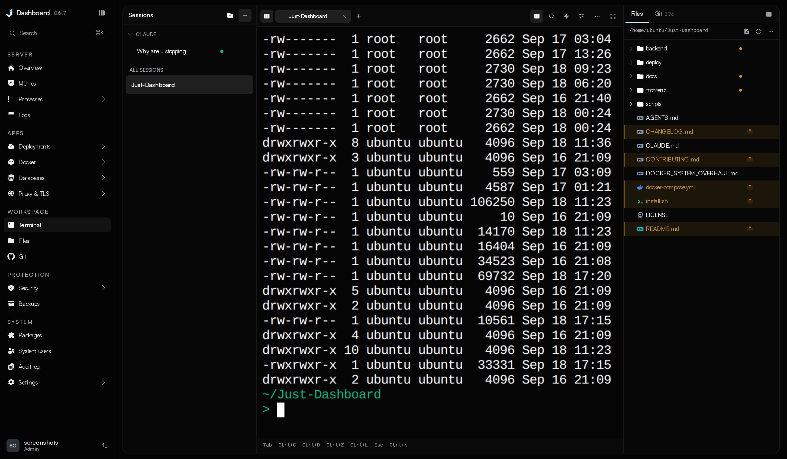
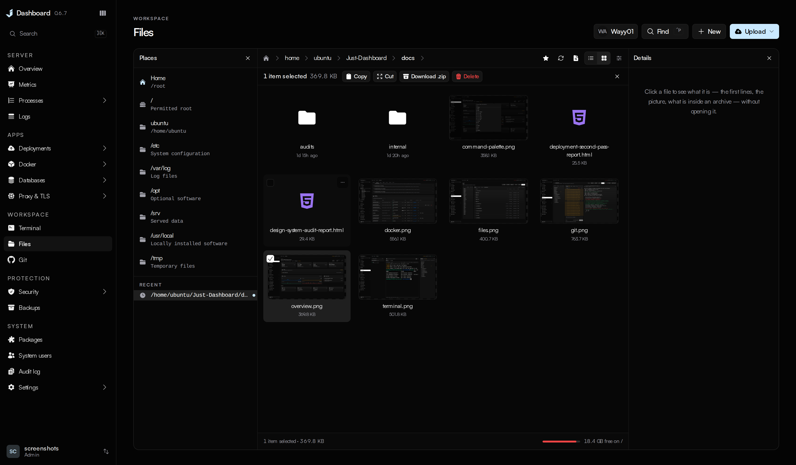
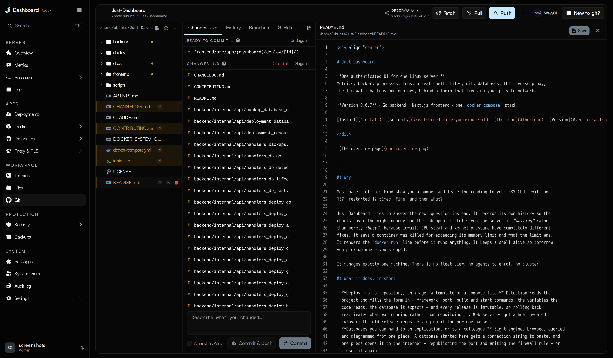
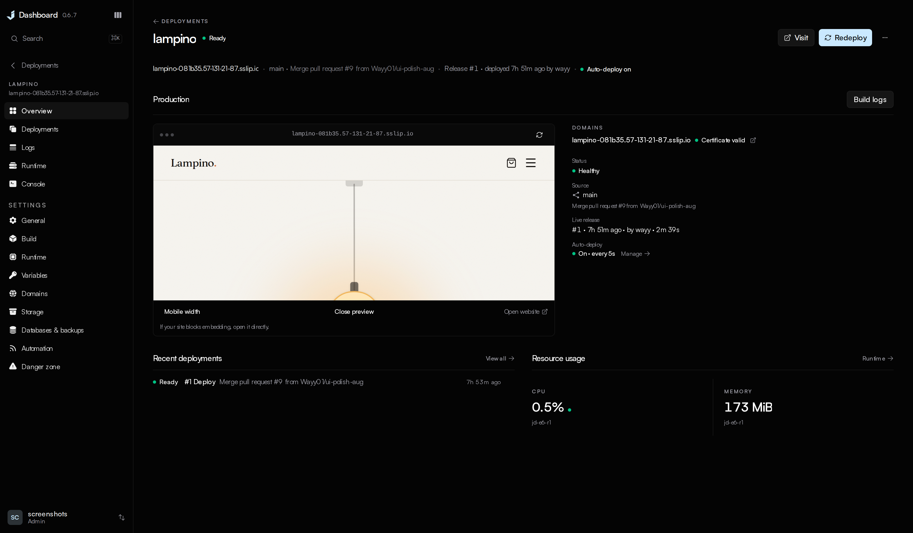
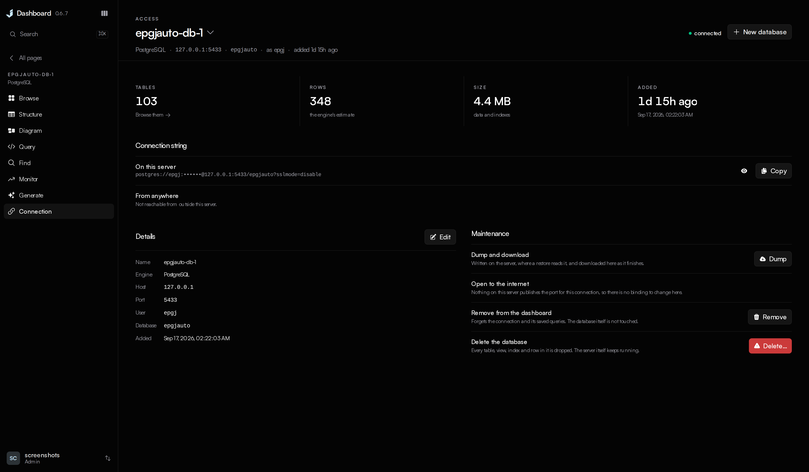

<div align="center">

# Just Dashboard

**One authenticated UI for one Linux server.**
Metrics, Docker, processes, logs, a real shell, files, git, databases, the reverse proxy,
the firewall, backups and deploys, behind a login that lives on your private network.

**Version 0.7.0** · Go backend · Next.js frontend · one `docker compose` stack

[Install](#install) · [Security](#read-this-before-you-expose-it) · [Support](#who-makes-this) · [The tour](#the-tour) · [Configuration](#configuration) · [Licence](#licence)

</div>



---

## Why

Most panels show you a number and leave the reading to you: 68% CPU, exit code 137, restarted
12 times. Just Dashboard tries to answer the next question instead. It says the server is
*waiting* rather than merely *busy*, that a container was killed for its memory limit and what
the limit was, and where the dashboard can fix a finding, the finding comes with a button.

It manages exactly one machine. There is no fleet view, no agents to enrol, no cluster.

## What it does

- **Deploys from a repository, an image, a template or a Compose file.** Detection fills the
  form in — it picks the application out of a repository's examples, docs and tooling, plans a
  volume for the SQLite file, uploads or key ring an app would otherwise lose on its next release,
  and says before you deploy what it will not run. Every deployment is checked against the commit it
  builds before it builds, and what would stop it or deserves a look is shown before Deploy is
  pressed. Every release is immutable, so rollback reactivates what ran before. Web services get a
  health-gated cutover.
- **Databases you can hand out.** Eight engines browsed, queried and diagrammed from one place. A
  database started here gets a connection string, and one press opens it to the internet or
  closes it again.
- **Fifty-seven reviewed templates, each one saying how you get in.** PostgreSQL, Redis, n8n,
  Grafana, Uptime Kuma, Vaultwarden, Nextcloud, Jellyfin, code-server, Ollama, Open WebUI, ntfy,
  Qdrant, NocoDB and more, one click each — and every card says whether you create the first
  account yourself, sign in with a password this server generated, or find no sign-in page at all.
- **Automatic Git deployments, previews and notifications.** Push to deploy, approved previews
  per pull request, and every run reported to Discord, Slack, Telegram, e-mail, a webhook and
  the commit's status on GitHub.
- **Backups that know what is not backed up.** Every volume, stack, deployment, repository and
  database listed, one press from a job, with writers frozen while the archive is taken.
- **A real shell, a real file manager, the repositories on the disk.** Host shells that survive
  the tab closing, a file manager with previews and an editor, and every Git checkout with
  staging, history, branches and pull requests.

## Install

```bash
git clone https://github.com/JustDashboard/Just-Dashboard.git
cd Just-Dashboard && sudo ./install.sh
```

The installer asks how you intend to reach it. **Tailscale is the default**: the machine stays
invisible to the internet and the dashboard answers at `https://your-box.tailnet-name.ts.net:8443`
with a real certificate. **An SSH tunnel is the fallback**, served on loopback. It then generates
the master key and a first password, builds the stack and prints the command to get in.
Everything it asked is editable afterwards under **Settings → Configuration**. It also installs
the host tools the web terminal and the dashboard's pages run on the server itself — `gh` from
GitHub's own repository, `git-lfs`, `whois` and `traceroute` — where they are missing, so a GitHub
sign-in on the Git page works from the terminal and over ssh too.

To upgrade, `git pull` and `docker compose up -d --build`, use the in-app update, or run
`sudo ./install.sh` again. All three keep your `.env`, database, accounts and sessions; only
the installer adds host tools a newer release relies on.

## Read this before you expose it

**This dashboard is root-equivalent.** Anyone who reaches it with a valid session has root on
the machine. It is built to sit behind a VPN or an SSH tunnel, and that is enforced:

- The backend refuses to start on a non-loopback address without a `JD_ALLOWED_CIDRS` allowlist,
  and the allowlist is checked before authentication.
- Two-factor is enforced for every account that has enrolled. `JD_REQUIRE_2FA` decides whether an
  account *must* enrol.
- Destructive actions pause for confirmation; the rare unrecoverable ones require a typed phrase,
  checked on the server.
- Every state-changing request lands in an audit log.

## Who makes this

Just Dashboard is built by one person, [Wayy01](https://github.com/Wayy01), under the
[JustDashboard](https://github.com/JustDashboard) organisation. The dashboard is free and every
feature stays free. If it has saved you an evening, there is a
[Buy Me a Coffee page](https://buymeacoffee.com/ionmoisei72) — entirely optional.

**Sponsors.** Companies and individuals who would like to sponsor the project can write to
[ionmoisei755@gmail.com](mailto:ionmoisei755@gmail.com) and will be listed here with a logo and
a link. *No sponsors yet — the space is open.*

---

## The tour

### Everything is one keystroke away



**⌘K** from anywhere. The sidebar drills into a section — Docker, Databases, Security, one
deployment — and every page comes back the way you left it.

### Docker



Create containers from a template, a pasted `docker run` or a form, with the command rendered
before it runs. Two verdicts: what Docker reports, and what needs attention — exposure, disk,
memory limits, security posture — each with an explanation and, where possible, a button.
Stacks deploy, rebuild and roll back with the compose diff shown first.

### Terminal



A real PTY into a host account. Sessions group windows, each named after what it is running,
and they survive the tab closing. Files and Git sit beside the shell.

### Files



Browse, preview, edit with a diff before saving, drag and drop, upload whole folders, crop
pictures, chmod, search by content, archive and extract. Every path is checked against
`JD_FILE_ROOTS` before anything happens.

### Git



Every repository under the configured roots. Stage, commit, push, stash, branch, merge, tag, and
open pull requests from the page, signed in to GitHub with the same device flow `gh` uses.
Stage individual lines or chunks, resolve conflicts, compare branches, inspect blame and signatures,
recover commits, and edit local history with a recovery branch. Worktrees, submodules, Git LFS and
patch import/export open in the same workspace. Review GitHub pull requests and Actions job logs,
or connect a GitLab/Gitea token for requests on those providers.

### Deployments



Point it at a repository, an image, a template, a Compose stack or something already running. It
says what it found, shows the plan, and runs it as a job with a permanent URL. Each project has
an overview with a live preview, deployments with rollback, logs, runtime, a console and settings.
Setup can generate template credentials and suggest a public address, create and connect a private
database on this server, or use an external database connection. Build commands, variables, storage,
health checks and runtime limits remain editable before the first deployment.

### Databases



PostgreSQL, MySQL and MariaDB, SQLite, SQL Server, ClickHouse, Oracle, MongoDB and Redis. Browse
and edit rows, change the structure, run queries, draw the schema, and hand out the connection
string — on this server or, with one press, from anywhere.

### And the rest

| | |
| --- | --- |
| **Metrics** | CPU split by user, system, iowait and steal; memory judged on what is available; pressure, disks, inodes, sockets and interfaces, with seven days of history the backend records itself. |
| **Processes** | Live table, PM2, systemd services and cron jobs, each with its verbs as words. |
| **Logs** | Files, container output, PM2 and the journal in one viewer, filtered on the server. |
| **Proxy & TLS** | Sites written as ordinary nginx, streams, certificates through certbot including DNS wildcards, and a live TLS report. |
| **Security** | A verdict on the host: firewall (ufw or firewalld), sshd, fail2ban, open ports, connections, logins and who is attacking. |
| **Backups** | Scheduled archives to disk, S3 or B2, native database dumps, single-file and in-place restore, and a list of what is not covered. |
| **Updates** | The dashboard updates itself in one click; host packages on apt, dnf, yum, zypper, pacman or apk. |
| **Settings** | The panel's own address, certificate, allowlist, two-factor policy and ports, applied with automatic rollback if the new configuration does not come up. |

---

## Version, and updating

This is **0.7.0**. It is not 1.0 because the API is still moving. Every release is in
[CHANGELOG.md](CHANGELOG.md) and in the dashboard itself, where **Update now** pulls, rebuilds
and restarts from a container that outlives the restart. The update check is one unauthenticated
GET of one file from GitHub; `JD_UPDATE_CHECK=false` turns it off.

Cutting a release: write the notes in `backend/internal/selfupdate/changelog.json`, then run
`scripts/release.sh <version>`. It bumps the version everywhere and regenerates the changelog.

## Roles

| | `readonly` | `limited` | `admin` |
| --- | :---: | :---: | :---: |
| View everything | ✅ | ✅ | ✅ |
| Start / stop / restart, git, edit files | | ✅ | ✅ |
| Terminal, delete, prune, restore, updates, accounts, firewall | | | ✅ |

Capabilities are checked on the route, never in the UI alone. `readonly` reads any file inside
`JD_FILE_ROOTS`, so give it to someone you would let read the disk.

## Configuration

<details>
<summary>Every environment variable the backend reads</summary>

<br>

The installer writes the ones that matter. These are for tuning afterwards.

**Required**

| Variable | Description |
| --- | --- |
| `JD_MASTER_KEY` | 64 hex characters. Encrypts every stored secret. `openssl rand -hex 32`. |

**Network perimeter**

| Variable | Default | Description |
| --- | --- | --- |
| `JD_SITE` | `localhost` | The address the stack answers on and the name on its certificate. Your machine's MagicDNS name (`box.tailnet-name.ts.net`) is the recommended value. Loopback is bound alongside it either way, so an SSH tunnel always works. Never `0.0.0.0`. |
| `JD_BIND` | none | What the proxy listens on, when that is not the same string as `JD_SITE`. Blank uses `JD_SITE`. A Tailscale install answers for a MagicDNS name and binds the tailnet IP behind it, because the proxy container resolves names through Docker's resolver rather than the host's. |
| `JD_TLS` | `internal` | How the connection is trusted. `tailscale` serves the certificate `tailscale cert` issues for `JD_SITE` — publicly trusted, no browser warning, renewed automatically. `internal` is Caddy's own CA, which is what produces "not secure". `off` is plain HTTP and is refused on anything but loopback. |
| `JD_ALLOWED_CIDRS` | `127.0.0.1/32,::1/128` | Who may reach the API at all, checked before authentication. Use `100.64.0.0/10,127.0.0.1/32,::1/128` for Tailscale, and keep loopback or you lose the tunnel. |
| `JD_TRUSTED_PROXIES` | none | Addresses allowed to set `X-Forwarded-For`. Without it a client could spoof its way past the allowlist. One hop is supported: the bundled Caddy replaces the header with the client's real address, so anything placed *in front* of Caddy becomes the client as far as the allowlist is concerned. |
| `JD_PORT` | `8443` | The port you connect to — the only one the proxy publishes. |
| `JD_BACKEND_PORT` | `8080` | The API's loopback port, behind the proxy. `install.sh` picks a random high port on a new install so nothing collides with it. |
| `JD_FRONTEND_PORT` | `3000` | The UI's loopback port, behind the proxy. Likewise randomised at install time. |
| `JD_ADDR` | `127.0.0.1:$JD_BACKEND_PORT` | Where the API binds, if you need to override the host as well as the port. Leave it on loopback; the proxy is the entry point. |
| `JD_ALLOWED_ORIGINS` | none | Complete browser origins allowed to open WebSockets. Scheme, host, and port must match; only needed if the UI is served from a different origin. |

**Behaviour**

| Variable | Default | Description |
| --- | --- | --- |
| `JD_REQUIRE_2FA` | `false` | Whether an account with no authenticator may sign in. An account that *has* enrolled is always asked for its code, whatever this says. |
| `JD_TERMINAL_ENABLED` | `true` | The web terminal. |
| `JD_TERMINAL_SHELL` | account's shell | The shell the web terminal opens. Empty honours `chsh`. `install.sh` sets it to the host's zsh, which the bundled startup gives inline history suggestions and command colouring; ssh is unaffected. |
| `JD_TERMINAL_USER` | lowest regular account | Host account a terminal session logs in as. |
| `JD_SESSION_TTL` | `12h` | Absolute session lifetime. |
| `JD_SESSION_IDLE_TTL` | `60m` | Idle timeout. |
| `JD_DOCKER_HOST` | `unix:///var/run/docker.sock` | Docker Engine endpoint. |
| `JD_DEPLOY_HEAVY_SLOTS` | `1` | Concurrent deployment build/activation workers. Valid range: 1–8. |
| `JD_DEPLOY_LIGHT_SLOTS` | `2` | Concurrent validation/metadata deployment workers. Valid range: 1–8. |
| `JD_DEPLOY_LEASE_TTL` | `30s` | Time before a silent deployment worker claim is reconciled after a crash. Valid range: 5s–5m. |
| `JD_METRICS_INTERVAL` | `15s` | How often the backend samples the host, and every running container, into its own history. Clamped to 5s and 5m. |
| `JD_METRICS_RETENTION` | `7d` | How long that history is kept. Accepts days. `0` records nothing and leaves only the live feed. |
| `JD_UPDATE_CHECK` | `true` | Whether the dashboard may ask GitHub whether a newer version of *itself* exists — one unauthenticated GET of one file, four times a day, carrying nothing but a version number. `false` turns it off; the release notes for the version you run stay readable, since they are compiled in. |
| `JD_ACME_DIRECTORY` | Let's Encrypt | Another ACME directory to order deployment certificates from: Let's Encrypt's staging endpoint for a rehearsal that spends no rate limit, or a private authority on a network that never sees the internet. Both the managed Caddy and certbot follow it. |
| `JD_ACME_CA_ROOT` | system roots | A PEM bundle to trust when that authority signs with its own roots — its issuing roots, and the root behind its directory's TLS listener if that is private too. With it set, the public-DNS check before an order is skipped, because a private authority validates however it was set up to. |
| `JD_UPDATE_REPO` | `JustDashboard/Just-Dashboard` | The repository releases are read from. Change it to follow a fork. |
| `JD_UPDATE_BRANCH` | `main` | The branch whose changelog decides what "newest" means, and which an in-app update fast-forwards to. |
| `JD_UPDATE_DIR` | discovered | The directory you cloned into. Normally empty: the dashboard asks Docker where its own stack was deployed from. Set it only if the Updates page says that failed. |
| `JD_AGENT_MODE` | `false` | Run as an agent managed by a hub: no login, mutual TLS only. Not useful on its own yet. |
| `JD_DEV` | `false` | Development only. Drops `Secure` from the session cookie so the UI works over plain HTTP. Never set it on a real host. |
| `JD_LOG_LEVEL` | `info` | `debug` for verbose logs. |

**Where it looks**

| Variable | Default | Description |
| --- | --- | --- |
| `JD_FILE_ROOTS` | `/` | Directories the file manager may reach. |
| `JD_LOG_ROOTS` | `/var/log` | Directories the log viewer may read. |
| `JD_COMPOSE_ROOTS` | `/opt,/srv,/home` | Where compose stacks are discovered. |
| `JD_GIT_ROOTS` | `/opt,/srv,/home,/root` | Where the Git page looks for repositories. |
| `JD_DEPLOY_ROOTS` | `/opt,/srv,/home,/root` | Where a deploy project's repository may live. A project outside these is refused. |
| `JD_NGINX_DIR` | `/etc/nginx` | nginx configuration root. |
| `JD_CADDYFILE` | `/etc/caddy/Caddyfile` | Caddy configuration file. |
| `JD_BACKUP_DIR` | `/var/backups/just-dashboard` | Local backup destination and staging. |
| `JD_DATA_DIR` | `/var/lib/just-dashboard` | The dashboard's own database. **Back this up.** |

**First run only**

| Variable | Default | Description |
| --- | --- | --- |
| `JD_BOOTSTRAP_USER` | `admin` | Account created on an empty database. |
| `JD_BOOTSTRAP_PASSWORD` | none | Leave empty for a generated one, logged once and replaced at first sign-in. A password set here is kept as is. |

Durations take a unit (`12h`, `60m`, and the metrics settings also accept `7d`); booleans
take `true` or `false`. A value that cannot be parsed stops the dashboard at startup rather
than falling back to the default, so a typo is visible instead of silently in effect.

</details>

<details>
<summary>Running it locally, and setting it up by hand</summary>

<br>

```bash
cd backend && go run ./cmd/server      # API on :8080
cd frontend && bun install && bun dev  # UI on :3000
```

Set `NEXT_PUBLIC_WS_BASE=http://localhost:8080` for WebSockets and `JD_ALLOWED_ORIGINS=http://localhost:3000`
on the backend. Before a pull request:

```bash
cd backend  && go build ./... && go vet ./... && go test ./...
cd frontend && bun run lint && bun run build && bun run test:browser
```

Without the installer: `cp .env.example .env`, set `JD_MASTER_KEY` (`openssl rand -hex 32`),
`JD_SITE` and `JD_TLS`, then `docker compose up -d --build`. The generated admin password is
printed once in `docker compose logs backend`.

</details>

## Backing it up

The dashboard's own state is a SQLite database in `JD_DATA_DIR` (`/var/lib/just-dashboard`).
Back up that directory **and** keep `JD_MASTER_KEY` somewhere separate; either alone will not
restore. The Backups page lists the dashboard itself under Coverage and writes that job for you.

## Licence

[AGPL-3.0](LICENSE). Run it, change it, distribute it, but if you run a modified version as a
network service, publish your changes. Contributions are welcome under the terms in
[CONTRIBUTING.md](CONTRIBUTING.md). The product logos bundled in `frontend/public/logos/` are their
owners' trademarks and keep their own licences, listed in that directory's `NOTICE`.
