<div align="center">

<a href="https://just-dashboard.com"></a>

# Just Dashboard

### Your whole Linux server, in one private control panel.

Deploy apps, run Docker, manage databases, shape the network, open a real shell and keep it all
backed up — behind one login that lives on your private network.

**Version 0.7.1** · Go backend · Next.js frontend · one `docker compose` stack

[](https://just-dashboard.com)
[](CHANGELOG.md)
[](LICENSE)
[](backend)
[](frontend)
[](docker-compose.yml)

**[just-dashboard.com](https://just-dashboard.com)** · [Install](#install) · [Features](#features) · [Tour](#a-quick-tour) · [Admin scripts](#terminal-admin-scripts) · [Security](#security-first) · [Configuration](#configuration) · [Support](#who-makes-this)

</div>

<br>

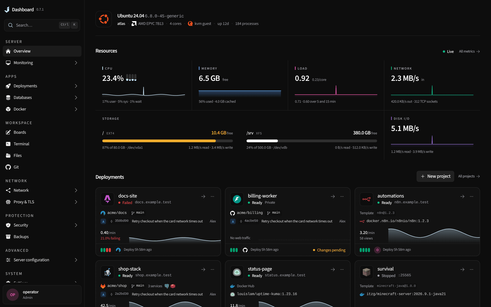

<p align="center"><sub>Screenshots show version 0.7.1 with example data.</sub></p>

---

## Why Just Dashboard

<table>
<tr>
<td width="25%" valign="top">

**Answers, not numbers**

It says *why*: a server that is waiting rather than busy, a container killed for its memory limit.
Where it can fix a finding, the finding comes with a button.

</td>
<td width="25%" valign="top">

**Private by design**

Root-equivalent power belongs behind Tailscale or an SSH tunnel. The allowlist runs before the
login, two-factor is per account, and every change is audited.

</td>
<td width="25%" valign="top">

**One server, done properly**

No fleet, no cloud account, no AI model or API key. One `docker compose` stack that knows the
machine it runs on, end to end.

</td>
<td width="25%" valign="top">

**Free, every feature**

Self-hosted and AGPL-3.0. Nothing is held back for a paid tier — every feature is free and stays
free.

</td>
</tr>
</table>

## Features

<table>
<tr>
<td width="50%" valign="top">

### 🖥️ Overview & monitoring

- A live overview of the machine: CPU, memory, load, network, storage and disk I/O
- Metrics with seven days of history the backend records itself, and CSV export
- Notable moments, top processes and the day's activity at a glance
- Processes, PM2 apps, systemd services and scheduled jobs, each with its verbs
- One log viewer for files, containers, stacks, PM2 and the journal, with insights
- Every service shows its own logs on its own page

</td>
<td width="50%" valign="top">

### 🚀 Deployments

- Deploy from a repository, an image, a Compose stack or **57 reviewed templates**
- Detects Node, Bun, Deno, Python, PHP, Go, Rust, Java, .NET, Ruby, Elixir and more
- Push to deploy, plus pull-request previews only your tailnet can reach
- Immutable releases, one-click rollback and health-gated cutover
- Build logs, runtime, console, request logs and traffic alerts per project
- Notifications to Discord, Slack, Telegram, e-mail, webhooks and GitHub

</td>
</tr>
<tr>
<td width="50%" valign="top">

### 🐳 Docker

- Overview of what every container uses and what just happened to it
- Containers, stacks, images, volumes, networks and events, each a page
- Create from a template, a pasted `docker run` or a form
- Crash loops, failing health checks and memory kills said in words
- Prepared fixes for exposure, limits and security posture
- Browse a volume's or a container's files in place

</td>
<td width="50%" valign="top">

### 🗄️ Databases

- A control center for every database on the server — even unconnected ones
- PostgreSQL, MySQL, MariaDB, SQLite, SQL Server, ClickHouse, Oracle, MongoDB, Redis
- Table editor with staged, reviewed edits and a SQL editor with plans
- Schema browser, diagram, code generation, performance and an advisor
- Key browser and console for Redis, documents and pipelines for MongoDB
- Protected connections, dump backups, accounts, grants and a live map

</td>
</tr>
<tr>
<td width="50%" valign="top">

### 🧰 Workspace

- A real terminal whose sessions survive the tab closing and dashboard restarts
- Split panes, drag-and-drop docking and one-click Codex and Claude launchers
- A file manager with search, previews, Monaco and image editors
- A full Git workspace: staging by line, history, branches, conflicts, PR reviews
- GitHub, GitLab and Gitea pull requests and Actions logs
- Boards: Excalidraw sketches with live cards for the host, projects and databases

</td>
<td width="50%" valign="top">

### 🌐 Network

- A live topology of devices, tunnels and Docker networks
- Interfaces, bridges, VLANs, namespaces, routing and policy rules
- Firewall, port forwarding, NAT, rate limits and blocklists
- WireGuard and Tailscale, DNS and ad-blocking, egress groups with failover
- Traffic per device, program and container, plus speed limits and SQM
- 26 diagnostics, packet captures, connection paths, drift and saved runs

</td>
</tr>
<tr>
<td width="50%" valign="top">

### 🔒 Proxy & TLS

- Every domain drawn through nginx or Caddy to the application it reaches
- Sites written as ordinary config, with a builder for auth and access rules
- Certificates through certbot, including DNS wildcards, with runway at a glance
- A live TLS report, streams, ports and per-site traffic
- Alerts on renewals and certificate drift

</td>
<td width="50%" valign="top">

### 🛡️ Security & backups

- A verdict on the host: exposure, SSH, logins and who is attacking
- fail2ban, CrowdSec and Suricata where they run
- Scheduled backups to disk, S3 or Backblaze B2, and native database dumps
- A coverage map of everything that is *not* backed up yet
- Single-file and in-place restore

</td>
</tr>
<tr>
<td width="50%" valign="top">

### ⚙️ Server & accounts

- Host package updates on apt, dnf, yum, zypper, pacman or apk
- System users, an audit log of every change and the panel's own settings
- Address, certificate, allowlist and ports applied with automatic rollback
- Roles, two-factor, sessions and API keys for every account
- One-click self-update, with the release notes compiled in

</td>
<td width="50%" valign="top">

### ⌨️ Everywhere

- **Ctrl/⌘K** searches projects, sites, containers, databases, repos and pages
- Previews each result with what it is connected to
- Keyboard shortcuts on every page — press **?** to see them
- Every page remembers where you left it
- A consistent, dark design built around readings rather than tiles

</td>
</tr>
</table>

## A quick tour

<table>
<tr>
<td width="50%" valign="top">
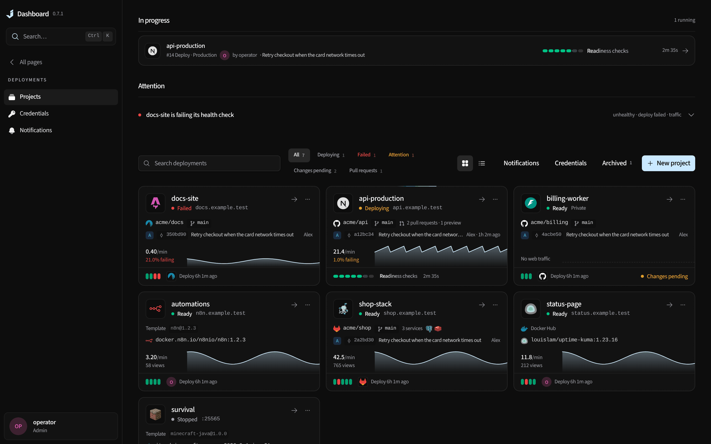
<p align="center"><b>Deployments</b> — every project, its traffic and its runs</p>
</td>
<td width="50%" valign="top">
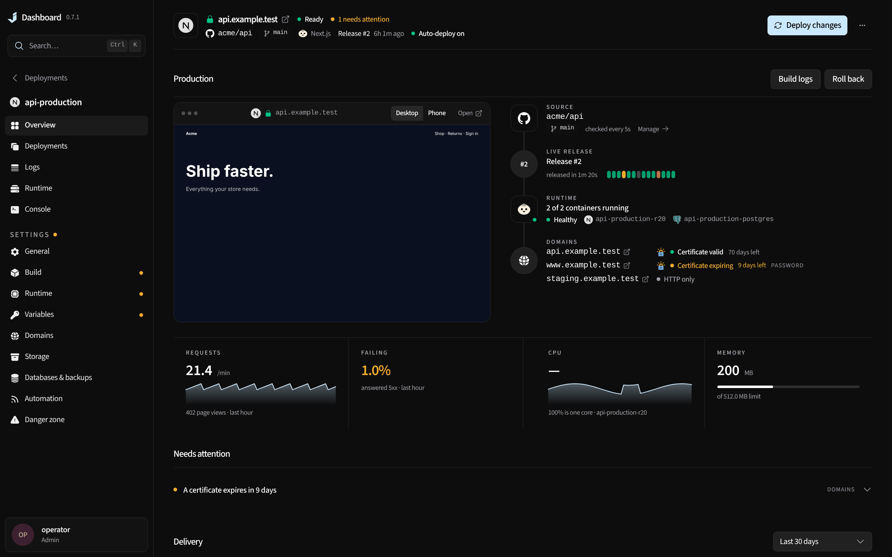
<p align="center"><b>A project</b> — live preview, release, runtime and domains</p>
</td>
</tr>
<tr>
<td width="50%" valign="top">
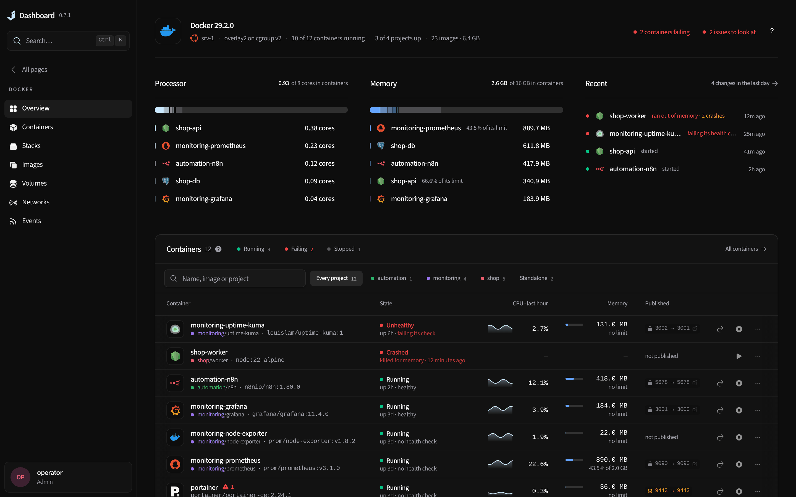
<p align="center"><b>Docker</b> — who uses what, and what just happened</p>
</td>
<td width="50%" valign="top">
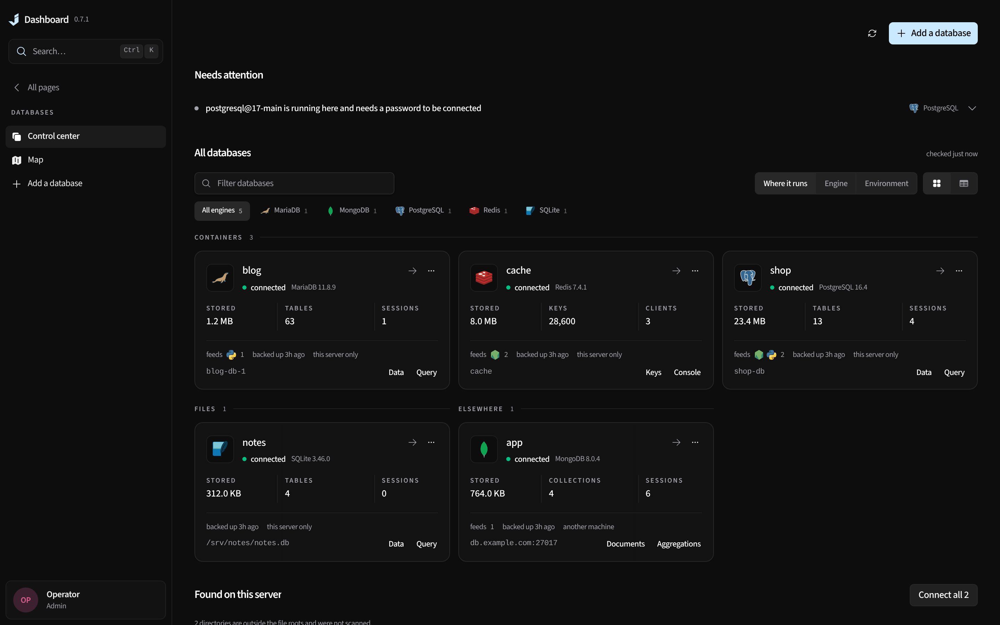
<p align="center"><b>Databases</b> — every engine on the server, each as itself</p>
</td>
</tr>
<tr>
<td width="50%" valign="top">
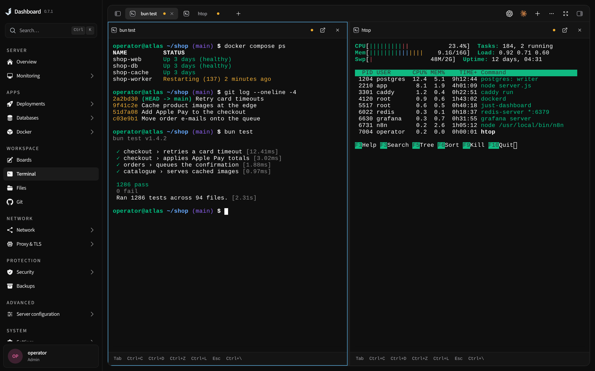
<p align="center"><b>Terminal</b> — persistent sessions and split panes</p>
</td>
<td width="50%" valign="top">
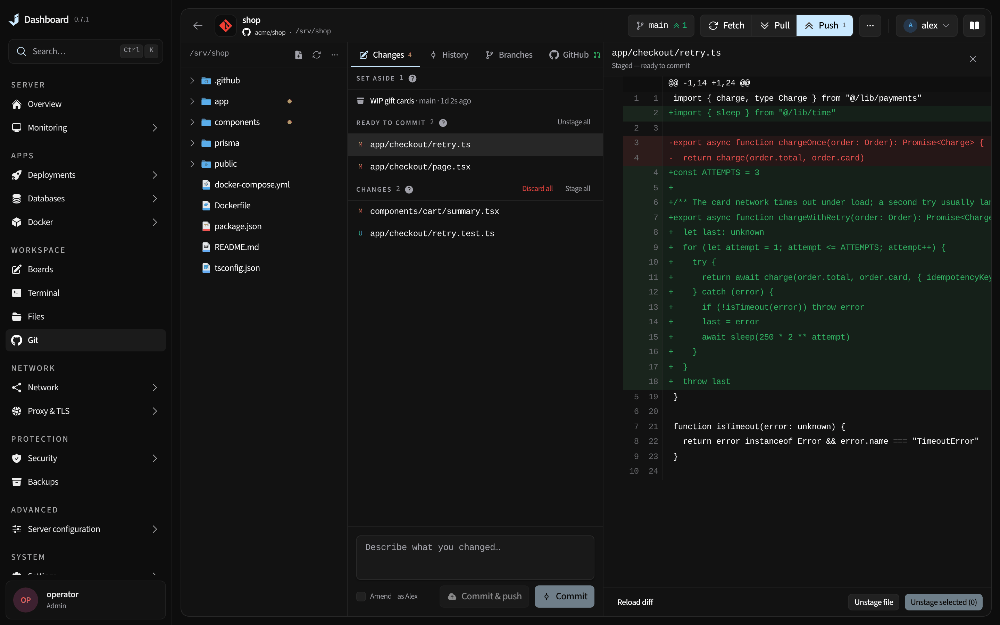
<p align="center"><b>Git</b> — stage, review and ship from the browser</p>
</td>
</tr>
<tr>
<td width="50%" valign="top">
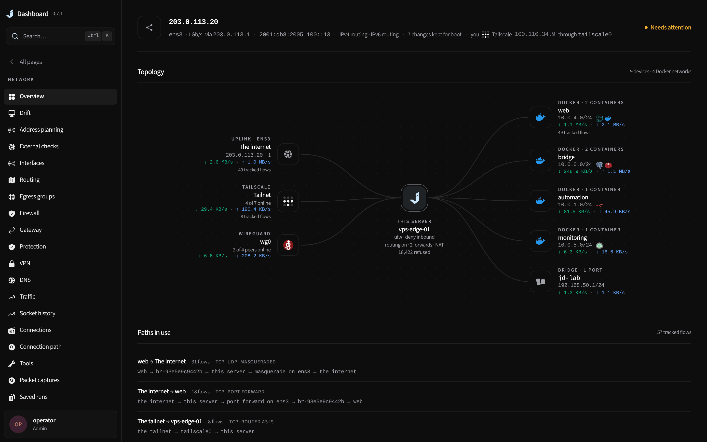
<p align="center"><b>Network</b> — the server as a router, drawn live</p>
</td>
<td width="50%" valign="top">
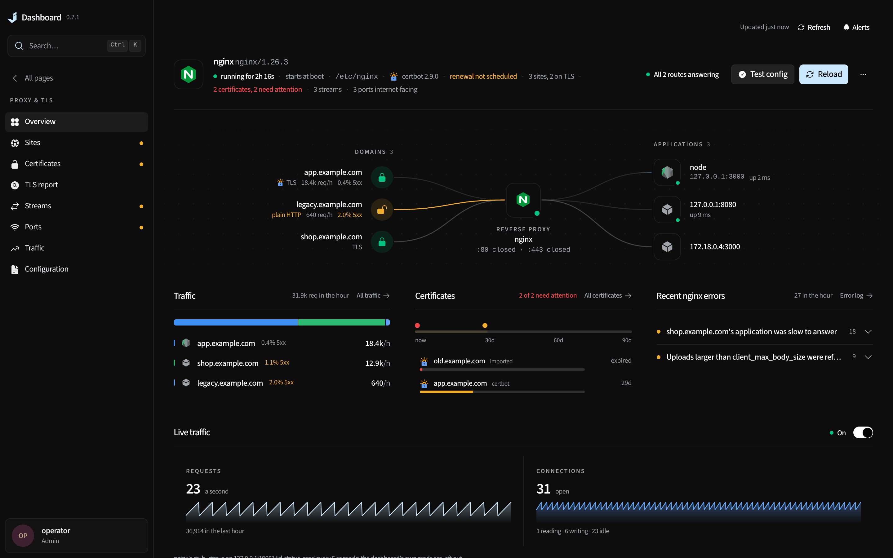
<p align="center"><b>Proxy & TLS</b> — domains, applications and certificates</p>
</td>
</tr>
<tr>
<td width="50%" valign="top">
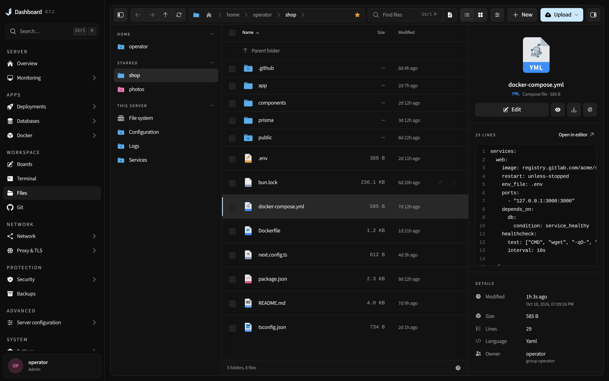
<p align="center"><b>Files</b> — browse, preview and edit anywhere you allow</p>
</td>
<td width="50%" valign="top">
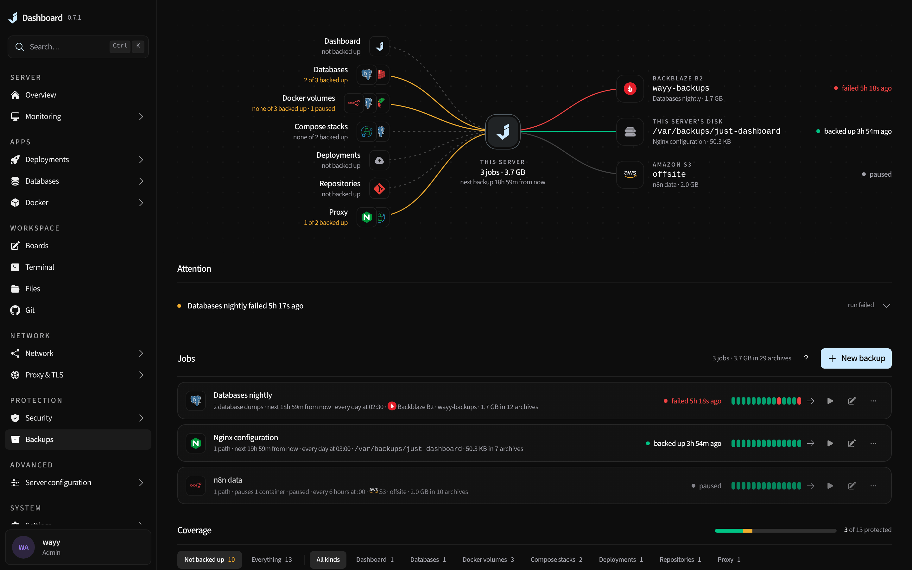
<p align="center"><b>Backups</b> — what is covered, and what is not</p>
</td>
</tr>
<tr>
<td width="50%" valign="top">
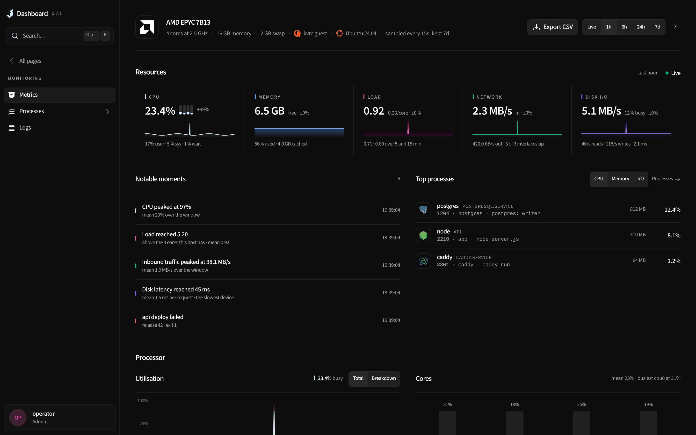
<p align="center"><b>Metrics</b> — a week of history, recorded by the server</p>
</td>
<td width="50%" valign="top">
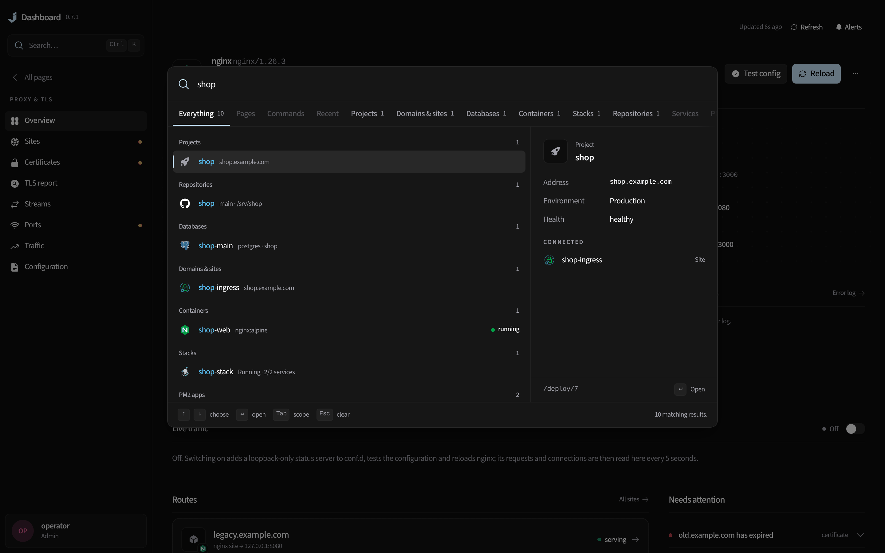
<p align="center"><b>Ctrl/⌘K</b> — everything one keystroke away</p>
</td>
</tr>
</table>

## Install

```bash
git clone https://github.com/JustDashboard/Just-Dashboard.git
cd Just-Dashboard && sudo ./install.sh
```

The installer asks one question that matters — how you will reach the dashboard — then does the
rest in four labelled stages:

- **Tailscale (default):** the machine stays invisible to the internet and the dashboard answers at
  `https://your-box.tailnet-name.ts.net:8443` with a real certificate.
- **SSH tunnel (fallback):** the dashboard is served on loopback only.
- It generates the master key and a first password, builds the stack and prints how to get in.
- It installs the host tools the terminal and pages rely on — `gh`, `git-lfs`, `whois`,
  `traceroute` — where they are missing.

Use `./install.sh --help` to preview the steps, or `sudo NO_COLOR=1 ./install.sh` for plain output.
Everything it asked is editable afterwards under **Settings → Configuration**.

**Upgrading:** use **Update now** in the dashboard, run `sudo ./install.sh` again, or `git pull`
followed by `docker compose up -d --build`. All three keep your `.env`, database, accounts and
sessions.

## Terminal admin scripts

Run these on the server from your checkout. They manage **dashboard accounts** (not Linux users) and
use the built backend image, so neither Go nor a browser login is needed — account commands work even
while the backend is stopped.

| Script | What it does |
| --- | --- |
| `sudo ./scripts/reset-password.sh admin` | Recover an account with a temporary password |
| `sudo ./scripts/create-user.sh alice limited` | Create an account (`readonly`, `limited` or `admin`) |
| `sudo ./scripts/manage.sh users` | List accounts, roles and two-factor status |
| `sudo ./scripts/manage.sh revoke-sessions alice` | Sign out every browser session for an account |
| `sudo ./scripts/manage.sh status` | Show the containers and their health |
| `sudo ./scripts/manage.sh logs [backend\|frontend\|proxy]` | Follow logs (Ctrl+C exits) |
| `sudo ./scripts/manage.sh restart` | Recreate the stack to apply `.env` edits |
| `./scripts/manage.sh --help` | Usage, no sudo needed |

<details>
<summary>How passwords and resets behave</summary>

<br>

Passwords are entered twice with hidden input and must meet the dashboard's strength rules. New and
reset passwords are temporary: the account holder changes them at sign-in, after any required
two-factor step. A reset clears failed-login lockout and revokes that account's sessions and API
tokens, while keeping two-factor enrolment, recovery codes, role and disabled state. Account changes
are audited as local root; `revoke-sessions` leaves API tokens unchanged.

For automation, append `--password-stdin` to either password command and pipe one password line from
a trusted source — never put passwords in arguments or shell history. The scripts find the checkout
from their own path and let Compose read `.env` without executing it. Run `restart` from SSH, since it
disconnects the web terminal; it recreates containers with current settings, which
`docker compose restart` alone does not.

</details>

## Security first

**This dashboard is root-equivalent.** Anyone who reaches it with a valid session has root on the
machine, so it is built to sit behind a VPN or an SSH tunnel — and that is enforced:

- The backend refuses to start on a non-loopback address without a `JD_ALLOWED_CIDRS` allowlist,
  and the allowlist is checked **before** authentication.
- Two-factor is enforced for every account that has enrolled; `JD_REQUIRE_2FA` decides whether an
  account *must* enrol.
- Capabilities are checked on every backend route, never in the UI alone.
- Destructive actions are confirmed and audited; deleting a project, database, stack or Git checkout
  asks for a typed phrase checked on the server.
- Every state-changing request lands in the audit log.

### Roles

| | `readonly` | `limited` | `admin` |
| --- | :---: | :---: | :---: |
| View everything | ✅ | ✅ | ✅ |
| Start / stop / restart, Git, edit files | | ✅ | ✅ |
| Terminal, delete, prune, restore, updates, accounts, firewall | | | ✅ |

`readonly` can read any file inside `JD_FILE_ROOTS`, so give it to someone you would let read the
disk.

## Version, and updating

This is **0.7.1**. It is not 1.0 because the API is still moving. Every release is in
[CHANGELOG.md](CHANGELOG.md) and in the dashboard itself, where **Update now** pulls, rebuilds and
restarts from a container that outlives the restart. The update check is one unauthenticated GET of
one file from GitHub; `JD_UPDATE_CHECK=false` turns it off.

## Configuration

<details>
<summary>Every environment variable the backend reads</summary>

<br>

The installer writes the ones that matter. These are for tuning afterwards.

**Required**

| Variable | Description |
| --- | --- |
| `JD_MASTER_KEY` | 64 hex characters. Encrypts every stored secret. `openssl rand -hex 32`. |

**Network perimeter**

| Variable | Default | Description |
| --- | --- | --- |
| `JD_SITE` | `localhost` | The address the stack answers on and the name on its certificate. Your machine's MagicDNS name (`box.tailnet-name.ts.net`) is the recommended value. Loopback is bound alongside it either way, so an SSH tunnel always works. Never `0.0.0.0`. |
| `JD_BIND` | none | What the proxy listens on, when that is not the same string as `JD_SITE`. Blank uses `JD_SITE`. A Tailscale install answers for a MagicDNS name and binds the tailnet IP behind it, because the proxy container resolves names through Docker's resolver rather than the host's. |
| `JD_TLS` | `internal` | How the connection is trusted. `tailscale` serves the certificate `tailscale cert` issues for `JD_SITE` — publicly trusted, no browser warning, renewed automatically. `internal` is Caddy's own CA, which is what produces "not secure". `off` is plain HTTP and is refused on anything but loopback; the API also accepts same-origin HTTP WebSockets for live features in this mode. |
| `JD_ALLOWED_CIDRS` | `127.0.0.1/32,::1/128` | Who may reach the API at all, checked before authentication. Use `100.64.0.0/10,127.0.0.1/32,::1/128` for Tailscale, and keep loopback or you lose the tunnel. |
| `JD_TRUSTED_PROXIES` | none | Addresses allowed to set `X-Forwarded-For`. Without it a client could spoof its way past the allowlist. One hop is supported: the bundled Caddy replaces the header with the client's real address, so anything placed *in front* of Caddy becomes the client as far as the allowlist is concerned. |
| `JD_PORT` | `8443` | The port you connect to — the only one the proxy publishes. |
| `JD_BACKEND_PORT` | `8080` | The API's loopback port, behind the proxy. `install.sh` picks a random high port on a new install so nothing collides with it. |
| `JD_FRONTEND_PORT` | `3000` | The UI's loopback port, behind the proxy. Likewise randomised at install time. |
| `JD_ADDR` | `127.0.0.1:$JD_BACKEND_PORT` | Where the API binds, if you need to override the host as well as the port. Leave it on loopback; the proxy is the entry point. |
| `JD_ALLOWED_ORIGINS` | none | Complete browser origins allowed to open WebSockets. Scheme, host, and port must match; only needed if the UI is served from a different origin. |

**Behaviour**

| Variable | Default | Description |
| --- | --- | --- |
| `JD_REQUIRE_2FA` | `false` | Whether an account with no authenticator may sign in. An account that *has* enrolled is always asked for its code, whatever this says. |
| `JD_TERMINAL_ENABLED` | `true` | The web terminal. |
| `JD_TERMINAL_SHELL` | account's shell | The shell the web terminal opens. Empty honours `chsh`. `install.sh` sets it to the host's zsh, which the bundled startup gives inline history suggestions and command colouring; ssh is unaffected. |
| `JD_TERMINAL_USER` | lowest regular account | Host account a terminal session logs in as. |
| `JD_SESSION_TTL` | `12h` | Absolute session lifetime. |
| `JD_SESSION_IDLE_TTL` | `60m` | Idle timeout. |
| `JD_DOCKER_HOST` | `unix:///var/run/docker.sock` | Docker Engine endpoint. |
| `JD_DEPLOY_HEAVY_SLOTS` | `1` | Concurrent deployment build/activation workers. Valid range: 1–8. |
| `JD_DEPLOY_LIGHT_SLOTS` | `2` | Concurrent validation/metadata deployment workers. Valid range: 1–8. |
| `JD_DEPLOY_LEASE_TTL` | `30s` | Time before a silent deployment worker claim is reconciled after a crash. Valid range: 5s–5m. |
| `JD_METRICS_INTERVAL` | `15s` | How often the backend samples the host, and every running container, into its own history. Clamped to 5s and 5m. |
| `JD_METRICS_RETENTION` | `7d` | How long that history is kept. Accepts days. `0` records nothing and leaves only the live feed. |
| `JD_UPDATE_CHECK` | `true` | Whether the dashboard may ask GitHub whether a newer version of *itself* exists — one unauthenticated GET of one file, four times a day, carrying nothing but a version number. `false` turns it off; the release notes for the version you run stay readable, since they are compiled in. |
| `JD_ACME_DIRECTORY` | Let's Encrypt | Another ACME directory to order deployment certificates from: Let's Encrypt's staging endpoint for a rehearsal that spends no rate limit, or a private authority on a network that never sees the internet. Both the managed Caddy and certbot follow it. |
| `JD_ACME_CA_ROOT` | system roots | A PEM bundle to trust when that authority signs with its own roots — its issuing roots, and the root behind its directory's TLS listener if that is private too. With it set, the public-DNS check before an order is skipped, because a private authority validates however it was set up to. |
| `JD_UPDATE_REPO` | `JustDashboard/Just-Dashboard` | The repository releases are read from. Change it to follow a fork. |
| `JD_UPDATE_BRANCH` | `main` | The branch whose changelog decides what "newest" means, and which an in-app update fast-forwards to. |
| `JD_UPDATE_DIR` | discovered | The directory you cloned into. Normally empty: the dashboard asks Docker where its own stack was deployed from. Set it only if the Updates page says that failed. |
| `JD_AGENT_MODE` | `false` | Run as an agent managed by a hub: no login, mutual TLS only. Not useful on its own yet. |
| `JD_DEV` | `false` | Development only. Drops `Secure` from the session cookie so the UI works over plain HTTP. Never set it on a real host. |
| `JD_LOG_LEVEL` | `info` | `debug` for verbose logs. |

**Where it looks**

| Variable | Default | Description |
| --- | --- | --- |
| `JD_FILE_ROOTS` | `/` | Directories the file manager may reach. |
| `JD_LOG_ROOTS` | `/var/log` | Directories the log viewer may read. |
| `JD_COMPOSE_ROOTS` | `/opt,/srv,/home` | Where compose stacks are discovered. |
| `JD_GIT_ROOTS` | `/opt,/srv,/home,/root` | Where the Git page looks for repositories. |
| `JD_DEPLOY_ROOTS` | `/opt,/srv,/home,/root` | Where a deploy project's repository may live. A project outside these is refused. |
| `JD_NGINX_DIR` | `/etc/nginx` | nginx configuration root. |
| `JD_CADDYFILE` | `/etc/caddy/Caddyfile` | Caddy configuration file. |
| `JD_BACKUP_DIR` | `/var/backups/just-dashboard` | Local backup destination and staging. |
| `JD_DB_UPLOAD_MAX_MB` | `2048` | Largest file one database import or uploaded dump may be, in MiB. |
| `JD_DATA_DIR` | `/var/lib/just-dashboard` | The dashboard's own database. **Back this up.** |

**First run only**

| Variable | Default | Description |
| --- | --- | --- |
| `JD_BOOTSTRAP_USER` | `admin` | Account created on an empty database. |
| `JD_BOOTSTRAP_PASSWORD` | none | Leave empty for a generated one, logged once and replaced at first sign-in. A password set here is kept as is. |

Durations take a unit (`12h`, `60m`, and the metrics settings also accept `7d`); booleans
take `true` or `false`. A value that cannot be parsed stops the dashboard at startup rather
than falling back to the default, so a typo is visible instead of silently in effect.

</details>

<details>
<summary>Running it locally, setting it up by hand, and contributor scripts</summary>

<br>

```bash
cd backend && go run ./cmd/server      # API on :8080
cd frontend && bun install && bun dev  # UI on :3000
```

Set `NEXT_PUBLIC_WS_BASE=http://localhost:8080` for WebSockets and `JD_ALLOWED_ORIGINS=http://localhost:3000`
on the backend.

Without the installer: `cp .env.example .env`, set `JD_MASTER_KEY` (`openssl rand -hex 32`),
`JD_SITE` and `JD_TLS`, then `docker compose up -d --build`. The generated admin password is
printed once in `docker compose logs backend`.

| Script | What it is for |
| --- | --- |
| `scripts/test-changed.sh` | Runs exactly the checks, Go tests and browser specs your diff can reach — run it before a pull request |
| `scripts/go-test-race.sh` | Runs Go packages under the race detector, split across processes |
| `scripts/release.sh <version>` | Cuts a release: bumps the version everywhere and regenerates the changelog from `backend/internal/selfupdate/changelog.json` |

See [CONTRIBUTING.md](CONTRIBUTING.md) before opening a pull request.

</details>

## Backing it up

The dashboard's own state is a SQLite database in `JD_DATA_DIR` (`/var/lib/just-dashboard`). Back up
that directory **and** keep `JD_MASTER_KEY` somewhere separate; either alone will not restore. The
Backups page lists the dashboard itself under Coverage and writes that job for you.

## Who makes this

Just Dashboard is built by one person, [Wayy01](https://github.com/Wayy01), under the
[JustDashboard](https://github.com/JustDashboard) organisation. Find out more at
**[just-dashboard.com](https://just-dashboard.com)**.

The dashboard is free and every feature stays free. If it has saved you an evening, there is a
[Buy Me a Coffee page](https://buymeacoffee.com/ionmoisei72) — entirely optional.

**Sponsors.** Companies and individuals who would like to sponsor the project can write to
[ionmoisei755@gmail.com](mailto:ionmoisei755@gmail.com) and will be listed here with a logo and a
link. *No sponsors yet — the space is open.*

## Licence

[AGPL-3.0](LICENSE). Run it, change it, distribute it, but if you run a modified version as a network
service, publish your changes. Contributions are welcome under the terms in
[CONTRIBUTING.md](CONTRIBUTING.md). The product logos bundled in `frontend/public/logos/` are their
owners' trademarks and keep their own licences, listed in that directory's `NOTICE`.

<div align="center">
<br>
<a href="https://just-dashboard.com"></a>
<br>
<sub><a href="https://just-dashboard.com">just-dashboard.com</a></sub>
</div>
