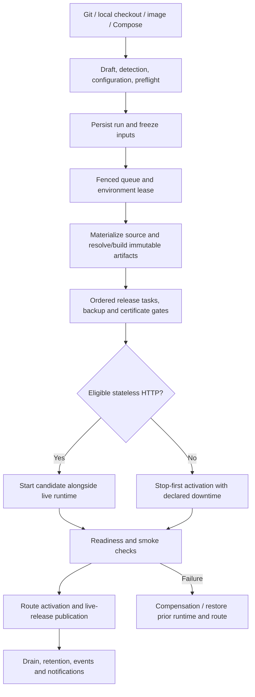

# Deployment audit and competitor comparison

**Audit date:** 2026-09-16 UTC. **Repository:** Just Dashboard, version 0.6.7.
**Source snapshot:** `d1389e7d58196f147607193307e78b4b802c0b0a` — “Enable automatic Git deployments and number runs per project”.

This report answers four questions: what demonstrably works, what only partly works, what competing
products offer, and what to build next. It includes source inspection, fresh automated checks, real
Docker/Compose/Caddy/nginx/database fixtures, additional probes, and current official competitor
documentation. Product code was not changed. The initial worktree was clean.

## Verdict

**Just Dashboard has a substantial working deployment engine. It is not yet demonstrably a better
general-purpose deployment product than Coolify.** Immutable artifacts, persisted execution,
health-gated activation, configuration snapshots, private Git polling, and integration with host
administration provide a credible foundation. Fresh live tests successfully exercised several of
these boundaries; this is more than a collection of unfinished screens.

The main problem is the gap between individual working components and an ordinary user's complete
deployment journey. This audit reproduced failures in build-variable delivery, static/framework
defaults, and command overrides. It also found two more serious data-protection gaps: previews inherit
production secrets and writable storage references, and a backup gate can accept a successful backup
that does not cover the requested named volume. The required verification gate was not fully green.

The best near-term position is **the most dependable deployment and recovery panel for one private
Linux server**. Win that measurable promise first. Competing on application breadth, team workflows,
and multiple servers requires additional product and architectural work.

### What “confirmed” means here

No finite audit establishes “100% works” for every application, host, failure, and future version.
Instead, this report makes narrow claims that can be reproduced:

| Label | Meaning |
| --- | --- |
| **Live** | Passed against real local infrastructure during this audit, for the stated fixture. |
| **Component** | Relevant fresh tests passed, but may use fake providers/executors, temporary SQLite, or mocked browser APIs. |
| **Partial** | Implemented, with a reproduced defect, significant unsupported case, or incomplete end-to-end evidence. |
| **Unavailable** | Code or UI exists, but the execution path deliberately refuses the operation. |
| **Absent** | No complete implementation was found in the inspected deployment subsystem. This is a source finding, not proof about unpublished work. |

A live adapter pass does not establish that its entire UI journey works. A passing test that
reproduces a defect confirms the defect, not the desired behavior. Competitor features below are
**documented**, not personally installed and acceptance-tested in this audit.

The map contains **71 capabilities: 10 Live, 27 Component, 22 Partial, three Unavailable, and nine
Absent**. Capabilities overlap and have different scopes; these counts are not a completion percentage.

## Verification results

The audit used Go 1.26.8 from `/tmp/jd-go1.26.8/bin/go`, Bun 1.4.0, Node 24.12.0, Docker 29.8.0,
Compose 5.5.1, Buildx 0.37.0, and Chromium. The repository declares Bun 1.3.11; that version was not
separately tested. The host's default Go 1.24.2 could not fetch the required toolchain because the
download returned HTTP 403, so the already available correct toolchain was used explicitly.

Ordinary database integration DSNs were pointed at an unavailable loopback port to prevent tests
from discovering operator-owned databases. The five deployment database engines were exercised
separately in isolated fixtures. Daemon-wide pruning was not run. Fixtures used their own containers,
volumes, and temporary files. One nginx container left by the failed Caddy test was identified and
removed explicitly after the audit; [cleanup evidence](evidence/fixture-cleanup.json) is retained.
Normal image/build caches may remain.

| Check | Fresh result | Interpretation and evidence |
| --- | --- | --- |
| Backend `go build ./...` | **Pass** | [Execution record](evidence/backend-build.json). |
| Backend `go vet ./...` | **Pass** | [Execution record](evidence/backend-vet.json). |
| Backend `go test -count=1 ./...` | **Pass, with skips** | 1,235 top-level tests passed; 29 skipped. Including subtests/fuzz seeds: 1,869 passed, 95 skipped. Counts are test executions, not distinct features. [Full result index](evidence/backend-tests.json). |
| Required deployment race suite | **Failed initially** | 446 top-level tests passed, 11 skipped, one failed. Fleet p95 was **530.574017 ms**, above its 500 ms budget, while other audit work was running. No `WARNING: DATA RACE` appeared in the full output. [Results](evidence/deployment-race.json), [failure detail](evidence/deployment-race-failure-detail.txt). |
| Isolated retry of failed race test | **Pass** | Same source, p95 **305.513868 ms** over 100 deployments, 10 statements/read. This supports sensitivity to execution conditions; it does not make the original full race run green or establish the cause. [Retry](evidence/fleet-race-retry.txt). |
| Frontend lint | **Pass** | [Record](evidence/frontend-lint.json). |
| Frontend production build | **Pass** | [Output](evidence/frontend-build.txt). |
| Frontend unit tests | **Pass** | 21 passed, zero failed, 53 assertions. [Output](evidence/frontend-unit.txt). |
| Chromium browser gate | **Failed** | 98 tests: **94 passed, one flaky, three failed**. Uses the repository's development-server approach and mocked APIs, not a live backend deployment. [Output](evidence/frontend-browser.txt). |
| Live build and activation adapters | **Pass** | Two top-level tests and ten subtests; npm recipe, Dockerfile, static image, immutable image, mixed Compose, failure preservation, checks, port collision, shutdown, and private Compose env cleanup. [Cases](evidence/live-artifacts-activation.json). |
| Live ingress | **Partial on first run; failed case passed on retry** | Real nginx webroot and fresh Caddy provisioning passed. Existing-site Caddy test initially failed during `docker port` with “page not found”; unchanged retry passed. Root cause unestablished. [Cases](evidence/live-ingress.json), [failure](evidence/live-ingress-failure-detail.txt), [retry](evidence/live-caddy-retry.txt). |
| Live database provisioning/connectivity | **Pass** | PostgreSQL, MySQL, MariaDB, Redis, MongoDB: provisioned fixture, separate app container authenticated using returned URL, cleanup exercised. [Cases](evidence/live-database-connections.json). |
| Additional audit probes | **Confirmed limitations** | Real build-variable experiment; detector, defaults, Go command, preview inheritance, and backup-coverage probes. See findings and [reproduction notes](evidence/README.md). |

The three browser failures were:

1. `slow polling has only one request in flight`: initial audit-log fixture never became visible.
2. `same-name PM2 applications use trusted daemon and process identities`: expected one socket, saw two.
3. `Redis scan cursors retain all unsigned 64-bit digits in requests`: an extra initial `"0"` request.

Each failed again on its configured retry. Duplicate development-time effects are a possible
explanation for parts of this pattern, **not a demonstrated root cause**. These failures do not prove
that PM2 identity routing or Redis integer precision is broken in production. They do prove that the
required browser gate currently fails in this environment. The deployment quick-setup success test
timed out on its first navigation assertion and passed on retry; that remains a flake to resolve.

### Exactly what the live passes establish

- A real npm Node recipe, custom Dockerfile, packaged static site, immutable image, and mixed
  build/pull Compose fixture produced usable artifacts. The fixture's build secret did not appear
  in inspected image layers. A failed build preserved the existing runtime.
- A real candidate exercised HTTP, TCP, Docker-health, command, and public-route check adapters.
  The “public-route” fixture used localhost; it does not prove external DNS, ACME, Internet routing,
  or an entire public deployment.
- Port selection survived a collision. Stop handling escalated from SIGTERM to bounded SIGKILL.
  Compose used pinned overrides and removed its private temporary environment file.
- Real Caddy routing/configuration and nginx challenge-webroot integration worked in fixtures, with
  the initial Caddy failure disclosed above. Imported/private test certificates are not evidence of
  successful public certificate issuance or renewal.
- All five quick-setup database engines accepted credentials from a separate application container.
  This does not establish replacement-safe addressing, upgrade safety, backups, replication, or
  disaster recovery for those engines.

### Important evidence not obtained

No clean-VM, real-browser → real-backend → real Git provider → public HTTPS application journey was
completed. No competitor was benchmarked on the same hardware. No public ACME renewal, hostile PR,
database-container recreation, persistent-data disaster restore, 24-hour soak, ARM64 matrix,
Internet webhook delivery, full framework/package-manager matrix, or request-level zero-downtime
load test was performed. Missing historical deployment checkpoint documents were not reconstructed
or treated as evidence.

## How the current system fits together

The control plane is the existing Go backend and SQLite store, with the Next.js interface. It owns
deployment planning and sequencing while Docker, Compose, proxy, certificate, backup, Git, secret,
and database modules retain their respective execution responsibilities. Deployment targets are
local to the one server. Existing agent enrollment code does not constitute a remote deployment
scheduler.

This is a simplified ownership and gating map, not an exact ordering guarantee for every release
task phase. Planning/configuration revisions are separate from release snapshots. Persisted runs,
step evidence, leases, cancellation, replay/resync, and immutable artifact references are meaningful
engineering strengths. External mutable state—database contents, filesystem data, and the resources
behind linked dependencies—is not made immutable by a release snapshot.

## Complete capability map

This is a deployment-product inventory, including the host features deployments depend on. It is
not a certification of every unrelated dashboard screen. A filterable copy is available as
[capability-matrix.csv](capability-matrix.csv).

### Sources and first deployment

| ID | Capability | Status | Confirmed scope and remaining limit |
| --- | --- | --- | --- |
| S01 | Draft/save/detect/preflight/commit | Component | API and SQLite journeys pass; saving does not itself start runtime execution. Full external journey remains untested. |
| S02 | GitHub-connected repository selection | Component | Existing GitHub/`gh` integration and browser flow; no fresh private-provider login-to-deploy trial. |
| S03 | Raw HTTPS/SSH Git sources | Component | Materialization, credentials, exact revision resolution, and source failures tested; not a live matrix of every Git provider. |
| S04 | Private mirrors and detached workspaces | Component | Source checkout and containment cases pass; submodules/LFS paths exist but were not exercised live here. |
| S05 | Local checkout | Component | Source adapter and planning coverage; remains a local-server workflow. |
| S06 | Existing container/stack adoption | Partial | Read-only inspection and observed ownership work in tests; adoption is not managed lifecycle takeover. |
| S07 | Image deployment | Live | Immutable image fixture resolves and activates; registry/provider/auth combinations are not exhaustively tested. |
| S08 | Compose text/upload/repository source | Live | Normalization plus mixed build/pull and activation fixtures pass; not arbitrary Compose compatibility or rolling stack deployment. |
| S09 | Automatic framework/port/file defaults | Partial | SvelteKit, static/Vite port, and Containerfile defects reproduced; see F03–F05. |
| S10 | Quick setup → settings/wizard recovery | Partial | Mocked browser recovery paths pass; success case flaky, and build-env handoff fails at execution without explicit mapping. |

Sources: [planning routes/tests](../../../backend/internal/api/handlers_deploy_planning_test.go),
[materializer](../../../backend/internal/deploy/source_materializer.go),
[adapters](../../../backend/internal/deploy/source_adapters.go),
[detector](../../../backend/internal/deploy/detector.go),
[quick setup](../../../frontend/src/components/deploy/quick-deploy.tsx).

### Build and artifact handling

| ID | Capability | Status | Confirmed scope and remaining limit |
| --- | --- | --- | --- |
| B01 | Automatic Node/npm recipe | Live | Real minimal npm fixture builds; not proof for arbitrary Next/Nuxt/monorepo/native-module applications. |
| B02 | pnpm/Yarn/Bun recipes | Component | Recipe selection/rendering and lockfile rules tested; no fresh full Docker build for each manager. |
| B03 | Go recipe | Partial | Fixed recipe exists; custom build/start commands are silently ignored. Fixed Go 1.25 base limits version control; F06. |
| B04 | Python recipe | Component | Requirements/uv/Poetry branches exist; explicit start command required. No fresh full Python application matrix. |
| B05 | PHP/Ruby/Java/.NET/Rust automation | Absent | No native automatic recipe found. These workloads can use their own Dockerfile or prebuilt image. |
| B06 | Custom Dockerfile | Live | Real fixture succeeds; Containerfile automatic filename handoff is wrong, although an operator can correct it. |
| B07 | Static build and serving image | Partial | Builder's real fixture passes; default UI ports/checks can prevent deployment or target the wrong port. |
| B08 | Digest pinning and Compose overrides | Live | Built and pulled artifacts resolved to immutable references; release override used in live Compose fixture. |
| B09 | BuildKit secrets and redaction | Partial | Explicitly mapped secret mounts and layer checks pass. Build scope alone does not supply the variable to a recipe build; F03. |
| B10 | Build cache and force rebuild | Component | Cache controls exist; no performance claim or remote/shared-cache benchmark established. |
| B11 | Language/package-manager version selection | Partial | Fixed catalog bases rather than a broad operator-controlled/version-file contract. Pinning a resolved digest is not selecting the correct language version. |
| B12 | Remote builders and build scheduling across hosts | Absent | Current builder runs against the local Docker owner. |

Sources: [artifact builder](../../../backend/internal/deploy/build_artifacts.go),
[builder tests](../../../backend/internal/deploy/build_artifacts_test.go),
[live artifact fixtures](../../../backend/internal/deploy/build_artifacts_live_test.go),
[Docker backend](../../../backend/internal/deploy/docker_artifact_backend.go).

### Execution, health, and recovery

| ID | Capability | Status | Confirmed scope and remaining limit |
| --- | --- | --- | --- |
| R01 | Durable queue/run/step persistence | Component | Runs persist before acceptance; leases, fencing, idempotency, and restart cases tested with controlled executors. |
| R02 | Bounded concurrency and supersession | Component | Heavy/light queues, per-environment exclusion, cancellation, retry, and stale-worker protection covered. No long-running fault-injection soak. |
| R03 | Frozen configuration and release inputs | Component | Source revision, config, variable revision references, dependency/check inputs, and artifact identity captured. External data remains mutable. |
| R04 | HTTP/TCP/Docker/command/route checks | Live | All five check adapters exercised; external/public-route correctness remains unverified. |
| R05 | Health-gated blue/green | Partial | Candidate and route mechanics tested; only eligible stateless proxy-owned HTTP workloads. No continuous-traffic proof of zero failed requests. |
| R06 | Stop-first deployment | Live | Container/Compose fixtures and bounded stop behavior pass. Writable state/fixed ports/other incompatible plans entail downtime. |
| R07 | Failed candidate compensation | Component | Prior runtime/route restoration and cancellation recovery tested; failed-build preservation also demonstrated live. Not a full power-loss matrix. |
| R08 | Rollback and restart | Component | Historical artifact/config selection and restart semantics tested. No database/schema/filesystem rollback guarantee. |
| R09 | Release tasks/migrations | Partial | Stored task execution and failure handling exist. Arbitrary migrations cannot be made reversible by app rollback. |
| R10 | Retention and shared-artifact protection | Component | Live release, retained successful releases, pins, active references, and shared digests protected by tests. No daemon-wide prune test on this host. |
| R11 | Replica autoscaling, canary weights, regional failover | Absent | No complete controller found. Blue/green is not these features. |

Sources: [queue](../../../backend/internal/deploy/orchestration_queue.go),
[engine tests](../../../backend/internal/deploy/engine_test.go),
[activation](../../../backend/internal/deploy/activation_executor.go),
[checks](../../../backend/internal/deploy/checks.go),
[release store](../../../backend/internal/deploy/release_store.go),
[live activation fixtures](../../../backend/internal/deploy/activation_live_test.go).

### Domains, networking, and TLS

| ID | Capability | Status | Confirmed scope and remaining limit |
| --- | --- | --- | --- |
| N01 | DNS/port/route/firewall preflight | Component | Availability and conflict logic covered; source review is not a full real-world NAT/DNS-provider compatibility test. |
| N02 | Share an eligible public Docker Caddy | Partial | Existing sites, route restoration, certificate import, and ownership checks passed on retry; initial live failure remains unresolved. |
| N03 | Provision Caddy on a fresh topology | Live | Isolated provision/restart fixture passed. No fresh public domain issuance was performed. |
| N04 | Host nginx challenge webroot | Live | Real local nginx challenge route worked. Does not itself prove an ACME order or renewal. |
| N05 | Automatic public HTTPS | Partial | Certificate-before-candidate orchestration and supported issuance paths exist; public CA/network boundary untested in this audit. |
| N06 | Wildcard/DNS-01 and arbitrary existing proxies | Partial | Existing suitable certificates can be used. No general automated DNS-provider flow or takeover of arbitrary Traefik/Apache/custom topology. |
| N07 | Network recovery and address stability | Partial | Caddy maintenance/recreation repair tested; reconciliation can have a gap. Quick database URLs currently use observed bridge IPs; F09. |

Sources: [preflight](../../../backend/internal/deploy/preflight.go),
[certificate executor](../../../backend/internal/deploy/certificate_executor.go),
[Caddy implementation](../../../backend/internal/proxysvc/docker_caddy.go),
[Caddy fixtures](../../../backend/internal/proxysvc/docker_caddy_test.go),
[ingress contract](../../internal/deployments/caddy-ingress.md).

### Variables, databases, and persistent data

| ID | Capability | Status | Confirmed scope and remaining limit |
| --- | --- | --- | --- |
| D01 | Encrypted variable revisions and controlled reveal | Component | Scoped variables, secret masking/reveal authorization, inert dotenv import, and audited mutation paths covered. Not an independent cryptographic audit. |
| D02 | Variable references/dependency resolution | Component | Typed references, missing-value failures, and cycle handling covered. Linked resource contents can change outside a snapshot. |
| D03 | Five quick-setup database engines | Live | PostgreSQL/MySQL/MariaDB/Redis/MongoDB provisioning and app-container login pass. Eight dashboard admin drivers do not mean eight quick-deploy engines. |
| D04 | Existing database linking | Partial | URL conversion/refusal rules tested; stable identity through recreation is not established. SQLite requires a shared-file arrangement. |
| D05 | Bind mounts and named volumes | Partial | Runtime mounts implemented; preview copies can reuse production sources, and backup coverage is incomplete. |
| D06 | Backup-before-deploy and freshness policy | Partial | Job execution/freshness and absolute-path coverage tested; named-volume false positive reproduced, Compose mounts not fully enumerated; F02. |
| D07 | Verified restore requirement | Unavailable | Gate explicitly receives `RestoreTested=false`; enabling the requirement blocks, rather than proving a restore. |
| D08 | App-consistent database recovery/PITR | Absent | No complete deployment-integrated recovery/PITR workflow demonstrated; file archive success is insufficient. |
| D09 | Preview secret/storage isolation | Partial | Environment records and ownership are separated, but production secrets and writable mount source names are copied; F01. |

Sources: [configuration store](../../../backend/internal/deploy/configuration_store.go),
[database connection adapter](../../../backend/internal/api/deployment_database_url.go),
[live DB fixtures](../../../backend/internal/api/deployment_database_live_test.go),
[runtime owner](../../../backend/internal/deploy/runtime_owner.go),
[backup gate](../../../backend/internal/api/deployment_backup_gate.go),
[preview creation](../../../backend/internal/deploy/automation.go).

### Automation and developer workflow

| ID | Capability | Status | Confirmed scope and remaining limit |
| --- | --- | --- | --- |
| A01 | Automatic branch polling | Component | Eligible remote production branches checked every five seconds after the first explicit deployment; revision pinning/deduplication/audit tests pass. No fresh real-provider push trial. |
| A02 | GitHub/GitLab/Bitbucket/Gitea signed hooks | Component | Signature, delivery reservation, repository/ref/event checks, and duplicate prevention tested using synthetic deliveries. Provider setup and Internet delivery not demonstrated. |
| A03 | Generic deploy hooks/API idempotency | Component | Scoped trigger and duplicate run prevention covered; endpoint still follows network policy. |
| A04 | Monorepo roots and watch paths | Partial | Root selection and hook watch filters exist. Branch polling does not apply those path filters, so they cannot globally suppress unrelated deployments. |
| A05 | Scheduled deploy/restart/backup/commands | Component | Timezone/DST, bounded chains, and required-step failure covered. Scheduled `game_command` is unavailable. |
| A06 | PR preview lifecycle/quota/close | Partial | Record/source/domain lifecycle tested; unsafe inheritance remains, and no provider-to-public-preview live journey was completed. |
| A07 | Fork/PR author trust policy | Absent | No author/collaborator approval boundary found in the preview trigger/event model. Signature verification authenticates delivery, not the safety of submitted code. |
| A08 | Notifications | Partial | Signed outbound webhook delivery/history/retry handling exists. No turnkey Slack/Discord/email product flow established. |
| A09 | GitHub App installation, PR status/comments | Absent | Current GitHub connection and webhook handlers are not a full GitHub App developer workflow. |
| A10 | Declarative deployment config/promotion/CLI | Absent | Compose and APIs exist; no complete project GitOps reconciliation, environment promotion, or supported deployment CLI workflow found. |

Sources: [Git watcher](../../../backend/internal/deploy/git_watch.go),
[watcher tests](../../../backend/internal/deploy/git_watch_test.go),
[automation](../../../backend/internal/deploy/automation.go),
[automation HTTP boundary](../../../backend/internal/api/handlers_deploy_automation.go),
[automation tests](../../../backend/internal/deploy/automation_test.go).

### Operations, catalog, and platform scope

| ID | Capability | Status | Confirmed scope and remaining limit |
| --- | --- | --- | --- |
| O01 | Fleet/workspace state and diagnostics | Component | Actual runtime state separated from persisted release state; diagnoses, filters, silences, and bounded query counts tested. |
| O02 | Run logs/events/replay/metrics/comparison | Component | Transcript/event handling, per-project run numbers, stage metrics, and secret-safe comparisons covered. Not a long-term removed-container log archive. |
| O03 | Browser settings/overview/lifecycle UI | Partial | Broad mocked API browser coverage; deployment success flake and overall gate failures disclosed above. |
| O04 | Archive and resource ownership | Component | Archive retains runtime/history and stops automation; managed/linked/observed semantics covered. |
| O05 | Managed removal and permanent record deletion | Component | Plan digest/confirmation, resource exclusions, and archive/inactive requirements tested. Permanent purge intentionally retains host resources and forgets ownership. |
| O06 | Blueprint catalog | Unavailable | 17 catalog entries and pure rendering/validation exist, but `deploymentSupported:false` prevents operational deployment. Not 17 working one-click apps. |
| O07 | New game-server deployment | Unavailable | Game/admin modules and blueprint inputs exist; catalog deployment blocked, scheduled game action unavailable, normalized UDP support incomplete. |
| O08 | Backend capabilities, audit, network/2FA policy | Component | Existing route/security regression tests passed in Go. Shared root-equivalent server, not tenant isolation; preview issue requires separate attention. |
| O09 | Host tools next to deployments | Component | Existing Docker/files/logs/databases/proxy/backup/process/terminal modules are reused. This audit does not certify every host feature. |
| O10 | Teams/project-scoped roles and tenant isolation | Absent | Global server capabilities are not granular team/project access control. |
| O11 | Multi-server deployment placement | Absent | No complete remote execution/placement/reconciliation workflow found. Agent enrollment is groundwork only. |
| O12 | Reproducible release gate and fleet performance | Partial | Required checks exist, but fresh browser/race results were not all green; no checked-in `.github` workflow was present. External CI was not assessed. |

Sources: [operations summaries](../../../backend/internal/deploy/operations_summary.go),
[diagnosis](../../../backend/internal/deploy/diagnosis.go),
[lifecycle](../../../backend/internal/deploy/lifecycle.go),
[purge tests](../../../backend/internal/deploy/purge_test.go),
[blueprint catalog](../../../backend/internal/blueprint/catalog.go),
[security contract](../../internal/security/invariants.md),
[contributor gate](../../../CONTRIBUTING.md).

## Reproduced defects and implementation gaps

Priorities describe product work, not a claim that an exploit or customer incident occurred.
**P0** means resolve before promoting the affected safety guarantee; **P1** means directly impairs
ordinary deployment or trustworthy release verification; **P2** means capability/operability expansion.

### F01 — Preview creation inherits production credentials and writable storage references — P0

**Observed:** `EnsurePreview` copies the production runtime-plan JSON and active variable ciphertext
into the new environment. It filters managed dependency records, but does not rewrite the mounts
inside the copied runtime plan. The runtime owner passes a named-volume source directly to Docker.
The isolated probe created a plan referencing writable `production-data` plus a production secret;
the preview inherited both unchanged.

**Impact:** Separate environment IDs do not guarantee separate data. A preview using that plan can
be configured to access the same writable volume, and copied secrets authorize the same external
services. There is no separate author/fork approval model in the inspected trigger/event path. This
audit did not execute hostile preview code or demonstrate an external exploit.

**Fix:** Give previews explicit variable and dependency policies; do not inherit production secrets
or writable sources by default. Allocate per-preview storage or a sanitized clone. Require trust
approval for untrusted PR authors/forks before any build/run receives credentials. Preserve signed
delivery verification and the existing network policy.

**Acceptance:** A real preview cannot read or modify a production sentinel volume or credential;
untrusted PRs cannot start privileged build/run work; close cleanup removes preview-owned resources
while production continues serving. Test linked database URLs as well as Docker mounts.

Evidence: [probe result](evidence/preview-inheritance-probe.txt),
[probe source](evidence/deployment_audit_probe_test.go.txt),
[preview copy logic](../../../backend/internal/deploy/automation.go#L919),
[mount execution](../../../backend/internal/deploy/runtime_owner.go#L122).

### F02 — A successful backup can falsely satisfy persistent-data coverage — P0

**Observed:** The backup gate only checks coverage when `filepath.IsAbs(source)` is true. A named
volume does not meet that condition. A real fixture archive of an unrelated temporary directory
was accepted as successful and fresh for a request requiring `production-data`. Activation also
collects persistent sources from top-level runtime mounts, not every normalized Compose service mount.

**Impact:** “Backup passed” can mean the deployment's actual persistent data was never included.
`RestoreTested` is explicitly always false, so restore-required policy correctly blocks but cannot
currently be satisfied through a verified restore workflow.

**Fix:** Resolve every volume/bind/Compose persistent dependency to an explicit backup manifest;
reject unknown or uncovered sources. Add database-aware consistency mechanisms where appropriate.
Persist restore-test evidence against the exact artifact, schema/application version, and data set.

**Acceptance:** Deliberately omit one named volume, one bind mount, and one Compose service volume;
each must block the deployment. Then restore a valid backup into an isolated environment and verify
a canary record through the application's connection before the gate can report recovery verified.

Evidence: [named-volume probe](evidence/data-boundary-probes.txt),
[probe source](evidence/api_audit_probe_test.go.txt),
[coverage check](../../../backend/internal/api/deployment_backup_gate.go#L39),
[mount enumeration](../../../backend/internal/deploy/activation_executor.go#L206).
The preview failure in the first combined probe log was an audit-fixture mistake: it attempted to
update an immutable revision. The corrected additive-revision probe is preserved separately; that
initial failure is not a product defect.

### F03 — Quick setup build variables do not reach the build command — P1

**Observed:** Quick setup imports environment variables with build and runtime scopes, while its
default build plan has an empty `secrets` mapping. The artifact builder supplies recipe secrets only
for explicit stage mappings. A real Docker build running `test -n "$NEXT_PUBLIC_API_URL"` failed with
the variable present in the builder input but no mapping. The same build succeeded after adding an
explicit mapping to the build stage.

**Impact:** Frameworks that compile public endpoints or other settings during build can fail or
silently bake incorrect values. Runtime injection is too late for a compiled frontend asset.

**Fix:** Define and expose a consistent contract for public build values and secret mounts. Wire
quick setup into it automatically; do not require users to discover an unrelated advanced mapping.
Warn that a value intentionally embedded into browser assets is public, even when transported with
a BuildKit secret mount.

**Acceptance:** Real Next and Vite fixtures consume a configured build value; the returned asset
contains the intended public value; private install credentials remain absent from layers/logs.

Evidence: [real build probe](evidence/targeted-probes.txt),
[build variable mapping](../../../backend/internal/deploy/build_artifacts.go#L247),
[quick setup](../../../frontend/src/components/deploy/quick-deploy.tsx),
[default build plan](../../../frontend/src/components/deploy/deployment-defaults.ts#L185).

### F04 — Static/Vite automatic defaults select no port or the wrong port — P1

**Observed:** A static or Vite candidate without a start script produces `internalPort:0` and no
readiness checks. Preflight requires readiness for these profiles. A Vite candidate with an inherited
start-script port keeps 3000, although the packaged nginx runtime serves on 80.

**Impact:** A supported static build can still be blocked in the default deployment flow or fail
its runtime checks. The successful static adapter fixture does not catch this UI-to-plan mismatch.

**Fix:** Derive port and readiness defaults from the resulting serving runtime. Separate build-time
development/start scripts from the packaged static runtime contract.

**Acceptance:** Deploy plain HTML and Vite projects, with and without a start script, from quick setup
without advanced edits; verify actual served content through the assigned route.

Evidence: [frontend probe](evidence/frontend-default-probes.txt),
[defaults](../../../frontend/src/components/deploy/deployment-defaults.ts#L180),
[readiness validation](../../../backend/internal/deploy/preflight.go).

### F05 — SvelteKit and Containerfile detection do not carry through correctly — P1

**Observed:** The detector checks generic Vite before SvelteKit. A package containing both becomes
`vite/static/dist`, not a SvelteKit application. Separately, detection recognizes a Containerfile,
but the default configuration writes `dockerfile:"Dockerfile"`.

**Impact:** The detected framework/file can lead to the wrong build/runtime plan. This is a
reproduced classification/default defect; no complete SvelteKit app was deployed during the audit.

**Fix:** Check specific frameworks before their underlying tools; require/validate supported
SvelteKit adapter/output semantics. Carry the detected Dockerfile path through unchanged.

**Acceptance:** Real SvelteKit server/static adapter fixtures and a Containerfile-only repository
build and serve correctly through quick setup, without correcting generated fields manually.

Evidence: [detector probe](evidence/targeted-probes.txt),
[filename probe](evidence/frontend-default-probes.txt),
[detector ordering](../../../backend/internal/deploy/detector.go#L373),
[defaults](../../../frontend/src/components/deploy/deployment-defaults.ts#L190).

### F06 — Go recipe silently ignores command overrides; runtime selection is narrow — P1

**Observed:** The Go renderer emits a fixed `CGO_ENABLED=0 go build` and `/app` entrypoint even when
custom build/start commands are configured. The source-level probe confirms both overrides disappear.
Its catalog base is `golang:1.25-alpine`; language version selection is not a broad supported contract.

**Impact:** Code generation, nonstandard builds, CGO requirements, and custom startup behavior may not
match the accepted configuration. The repository itself requires Go 1.26.8; a Go toolchain may attempt
its own download, but that does not constitute a supported version-selection workflow.

**Fix:** Honor overrides safely or reject/hide unsupported controls. Support explicit version inputs
and supported version files, recording resolved versions in build evidence. Keep Dockerfile escape
hatches for workloads outside a recipe's supported boundary.

**Acceptance:** A fixture requiring code generation proves its custom build ran; a custom start
behavior is observable; unsupported CGO/version requests fail at planning with an actionable reason.

Evidence: [renderer probe](evidence/targeted-probes.txt),
[catalog and renderer](../../../backend/internal/deploy/build_artifacts.go).

### F07 — Existing test coverage does not establish a reliable complete product journey — P1

**Observed:** All ordinary Go tests passed while F01–F06 remained reproducible. Browser APIs are
mocked. Browser and full race gates failed; Caddy and quick-setup tests required retries. No checked-in
GitHub CI workflow was found in this snapshot, although an external CI system may exist.

**Fix:** Add a required clean-host acceptance lane that connects the real UI/API, build, candidate,
proxy, secret, and persistence boundaries. Investigate the three browser failures and both flakes;
do not hide them with retry counts or looser budgets. Run performance measurements under declared
conditions and retain race checking independently so failures remain interpretable.

**Acceptance:** A reproducible clean checkout/install gate, all mandatory checks green, and complete
positive/negative deployment journeys retained as release evidence. A focused passing retry does not
replace the full required gate.

Evidence: [verification results](#verification-results), [raw evidence index](evidence/README.md).

### F08 — Automatic polling and hook watch filters have different semantics — P1

**Observed:** Eligible production branches poll automatically after the first explicit deployment.
Hook handlers apply changed-path filters; the Git watcher does not. No per-project polling opt-out
was found in the current model.

**Impact:** A monorepo path filter on a hook does not stop the polling path from deploying an unrelated
commit. Operators also lack a clear manual-only option for an otherwise eligible project.

**Fix:** Add explicit auto-deploy policy and apply the same branch/path decisions to polling and
webhooks. Persist a reason for deployment or suppression so the UI can explain the decision.

**Acceptance:** The same relevant/irrelevant commits delivered by polling and webhook produce the
same decision; duplicate delivery still creates one run; manual-only means no automatic run.

Evidence: [watcher](../../../backend/internal/deploy/git_watch.go),
[hook filter](../../../backend/internal/api/handlers_deploy_automation.go#L394).

### F09 — Database connectivity is confirmed only for the current container address — P1

**Observed:** Loopback database bindings are converted into the inspected default-bridge IP for
application containers. Live authentication works. The address is an observed container IP, not a
stable project DNS identity.

**Impact:** Replacement can change that address. This is an implementation/lifecycle risk, not a
reproduced outage: the audit did not recreate production databases or prove that every replacement
changes IP.

**Fix:** Provide an explicit managed network and stable DNS alias/service identity, with ownership
and connection reconciliation. Preserve refusal of unsafe or ambiguous DSN conversions.

**Acceptance:** Recreate a fixture database while deliberately changing its IP; the application
reconnects using the original logical connection name without editing its variables.

Evidence: [URL adapter](../../../backend/internal/api/deployment_database_url.go#L26),
[live tests](evidence/live-database-connections.json).

### F10 — Blueprint and game deployment breadth is not shipped — P2

**Observed:** The catalog contains 17 definitions: Adminer, Vaultwarden, PostgreSQL, MariaDB, MinIO,
Prometheus, nginx static, Caddy, Redis, Uptime Kuma, Dozzle, Minecraft Java, n8n, Minecraft Bedrock,
Grafana, MongoDB, and Gitea. Pure render/validation paths exist, but deployment is explicitly gated
unavailable. Game automation has an unavailable action, and the normalized runtime does not provide
a complete UDP deployment contract.

**Fix:** Finish a small catalog through the real deployment engine, each with version policy,
healthcheck, secret generation, storage ownership, backup/restore, upgrade, and removal tests.
Treat game support as a separate supported workload contract, including protocol checks and saves.

**Acceptance:** Count an app as supported only after install, health, upgrade, rollback limitations,
restore, and uninstall pass in isolation. Catalog JSON count is not deployed-app coverage.

Evidence: [catalog](../../../backend/internal/blueprint/catalog.go),
[blueprint adapter](../../../backend/internal/deploy/blueprint_source.go),
[documented unavailable boundary](../../internal/deployments/implementation.md).

## Competitors: what they actually document

Research is point-in-time official documentation/repository review on 2026-09-16. Documentation can
describe newer or optional features; no competitor binary was pinned or installed. “Available” below
means a documented product capability, not a 100% reliability certification. Pricing, stars, and
template counts are deliberately not used as quality scores.

### Direct alternatives

| Product | Position and documented strengths | Limits that matter here | What Just Dashboard should learn |
| --- | --- | --- | --- |
| **Coolify** | Broad app/service deployment UI, SSH-managed remote servers, multiple build methods, previews, database operations, and teams. [Architecture](https://coolify.io/docs/core/how-coolify-works), [build methods](https://coolify.io/docs/applications/builds/overview). | Rolling updates depend on eligible app topology and readiness; Compose does not get the same application rolling-update flow. Rollback uses the retained image with current configuration. [Rolling updates](https://coolify.io/docs/applications/deployments/rolling-updates), [rollback](https://coolify.io/docs/applications/deployments/rollbacks). | Compete with completed ordinary workflows, preview trust controls, and recovery clarity. Preserve JD's historical configuration snapshot advantage. |
| **Dokploy** | App/Compose UI, single-server and remote deployment, Swarm option, several builders, remote builders, previews and rollback workflows. [Deployment options](https://docs.dokploy.com/docs/core/deployment-options), [builds](https://docs.dokploy.com/docs/core/applications/build-type), [build servers](https://docs.dokploy.com/docs/core/remote-servers/build-server). | Named-volume backups exclude bind mounts. SSO/SCIM/custom roles/audit capabilities are listed under Enterprise; evaluate the actual edition. [Volume backup](https://docs.dokploy.com/docs/core/volume-backups), [Enterprise](https://docs.dokploy.com/docs/core/enterprise). | Strongest comparison for a modern integrated developer UI and remote build/deploy flow. Avoid copying backup blind spots. |
| **CapRover** | Opinionated Docker/Swarm deployment using CLI/Git/upload/image and `captain-definition`; documented health/rolling behavior. [Methods](https://caprover.com/docs/deployment-methods.html), [zero downtime](https://caprover.com/docs/zero-downtime.html). | Persistent apps use stop-first behavior. Compose support is experimental and supports only a subset; unsupported fields may be ignored. Instance backup excludes application images/volumes by default. [Compose](https://caprover.com/docs/docker-compose.html), [backup](https://caprover.com/docs/backup-and-restore.html). | Simplicity and predictable deployment contract. Be more explicit about unsupported configuration and recoverable state. |
| **Dokku** | Git-push/CLI-oriented deployment with extensible builders/plugins and deployment checks. [Git deploy](https://dokku.com/docs/deployment/methods/git/), [builders](https://dokku.com/docs/deployment/builders/builder-management/), [checks](https://dokku.com/docs/deployment/zero-downtime-deploys/). | Open-source core targets a different, CLI-centered workflow; extensions supply capabilities such as database services. Do not conflate it with paid Dokku Pro UI. [Project](https://github.com/dokku/dokku), [application deployment](https://dokku.com/docs/deployment/application-deployment/). | A concise configuration contract, dependable CLI/API automation, and extensibility without making core behavior ambiguous. |

### Feature-by-feature comparison

“Not established” means this research did not establish that capability; it is not a claim of absence.

| Dimension | Just Dashboard now | Coolify, documented | Dokploy, documented | CapRover / Dokku, documented |
| --- | --- | --- | --- | --- |
| Automatic build breadth | Node/Go/Python recipes with gaps; Dockerfile/image escape hatch | Nixpacks, Railpack **beta**, static, Dockerfile, Compose. [Source](https://coolify.io/docs/applications/builds/overview) | Nixpacks, Railpack, Heroku/Paketo, static and Dockerfile. [Source](https://docs.dokploy.com/docs/core/applications/build-type) | CapRover deployment definition; Dokku builder/plugin ecosystem. [CapRover](https://caprover.com/docs/deployment-methods.html), [Dokku](https://dokku.com/docs/deployment/builders/builder-management/) |
| Compose | Real local build/pull/pinned activation fixture; stop-first | Native Compose build/deploy option. [Source](https://coolify.io/docs/applications/builds/overview) | Compose or Swarm Stack; Stack cannot perform Compose builds. [Source](https://docs.dokploy.com/docs/core/docker-compose) | CapRover experimental subset; Dokku is primarily app/builder oriented in reviewed docs. [CapRover](https://caprover.com/docs/docker-compose.html), [Dokku](https://dokku.com/docs/deployment/builders/builder-management/) |
| Remote deployment/build | Not complete | SSH-managed servers and separate build-server architecture. [Architecture](https://coolify.io/docs/core/how-coolify-works), [builds](https://coolify.io/docs/applications/builds/overview) | Remote servers, separate builder, Swarm option. [Options](https://docs.dokploy.com/docs/core/deployment-options), [builder](https://docs.dokploy.com/docs/core/remote-servers/build-server) | CapRover uses Swarm; Dokku documentation focuses its app host. [CapRover](https://caprover.com/docs/zero-downtime.html), [Dokku](https://dokku.com/docs/deployment/application-deployment/) |
| Health-gated updates | Five adapters; readiness required for web/static plans, with default-generation defect | Eligibility and configured healthcheck matter; no healthcheck can mean running is treated as ready. [Source](https://coolify.io/docs/applications/deployments/rolling-updates) | Swarm health/update controls and automatic rollback. [Source](https://docs.dokploy.com/docs/core/applications/rollbacks) | CapRover healthchecks; Dokku configurable application checks and default wait. [CapRover](https://caprover.com/docs/zero-downtime.html), [Dokku](https://dokku.com/docs/deployment/zero-downtime-deploys/) |
| Zero downtime scope | Eligible stateless HTTP only; no traffic benchmark | Conditional; fixed-port/custom-name/static-IP/other cases stop first; not generic Compose rolling. [Source](https://coolify.io/docs/applications/deployments/rolling-updates) | Depends on Swarm/update configuration and health. [Source](https://docs.dokploy.com/docs/core/applications/rollbacks) | CapRover persistent apps stop first; Dokku checks/wait and retire delay are configurable. [CapRover](https://caprover.com/docs/zero-downtime.html), [Dokku](https://dokku.com/docs/deployment/zero-downtime-deploys/) |
| Rollback fidelity | Frozen artifact and historical deployment configuration; external data excluded | Retained image, **current** runtime variables/config; excludes DB/files. [Source](https://coolify.io/docs/applications/deployments/rollbacks) | Registry-backed manual rollback when enabled; Swarm automatic rollback. Historical secret/config fidelity not established here. [Source](https://docs.dokploy.com/docs/core/applications/rollbacks) | CapRover image rollback does not undo env/config. Dokku historical snapshot parity not established. [CapRover](https://caprover.com/docs/deployment-methods.html) |
| PR previews | Lifecycle exists; production secret/mount inheritance gap | Preview-specific env vars; GitHub App workflow and fork trust restrictions, with explicit public-PR opt-in. [Source](https://coolify.io/docs/applications/deployments/preview-deployments) | GitHub previews, quota, branch/label filters and cleanup; warns about public PR code. [Source](https://docs.dokploy.com/docs/core/applications/preview-deployments) | Equivalent built-in preview policy not established in reviewed core docs. |
| Database/data backup | Five DB provisioning fixtures pass; incomplete data coverage and restore proof | Engine-aware database backups and local/S3 storage; instance and workload backups differ. [Databases](https://coolify.io/docs/databases/backups), [architecture](https://coolify.io/docs/core/how-coolify-works) | Named-volume S3 backup, bind mounts unsupported by that feature. [Source](https://docs.dokploy.com/docs/core/volume-backups) | CapRover instance backup excludes app volumes/images by default. Dokku database extensions exist; verify each plugin's recovery contract. [CapRover](https://caprover.com/docs/backup-and-restore.html), [Dokku](https://dokku.com/docs/deployment/application-deployment/) |
| One-click services | 17 definitions; deployment unavailable | Maintained service template library. [Source](https://coolify.io/docs/services) | Public template catalog. [Source](https://dokploy.com/templates) | CapRover application ecosystem; Dokku plugin ecosystem. Do not equate catalog size with verified recovery. [CapRover](https://caprover.com/docs/deployment-methods.html), [Dokku](https://github.com/dokku/dokku) |
| Teams and roles | Server-wide capabilities; no project/team tenancy | Owner/Admin/Member roles; Member mostly read-only, tokens team-scoped. [Source](https://coolify.io/docs/core/team/roles-and-permissions) | Advanced organization controls include Enterprise features. [Source](https://docs.dokploy.com/docs/core/enterprise) | Fine-grained parity not established in this comparison. |
| Private-control-plane automation | Automatic Git polling does not need inbound provider hooks; PR hooks still need reachable approved ingress | SSH-managed workloads; Git/provider workflows documented. [Architecture](https://coolify.io/docs/core/how-coolify-works), [previews](https://coolify.io/docs/applications/deployments/preview-deployments) | Git/provider workflows and remote servers documented. [Options](https://docs.dokploy.com/docs/core/deployment-options), [previews](https://docs.dokploy.com/docs/core/applications/preview-deployments) | Dokku Git push is a direct authenticated deployment workflow. [Source](https://dokku.com/docs/deployment/methods/git/) |

### Adjacent competitors worth tracking

| Product | Why it competes | Relevant lesson, not a claim that it replaces every PaaS feature |
| --- | --- | --- |
| **Komodo** | Multi-server Docker/Compose/Swarm management through Core and Periphery, build orchestration, logs/metrics, permissions and identity integrations. [Introduction](https://komo.do/docs/intro) | Its Git-backed TOML resource sync and procedures make repeatable infrastructure and ordered/parallel operations first-class. These are relevant future gaps for JD. [Resources](https://komo.do/docs/resources), [procedures](https://komo.do/docs/automate/procedures). |
| **Portainer CE** | Container/infrastructure administration overlaps with JD's host-management audience. Distinguish Community and Business editions. [Project](https://github.com/portainer/portainer) | Stacks can come from Git/editor/upload/templates, with update workflows. Current docs mark specific features such as relative-path volume handling as Business; do not call all GitOps paid. [Stacks](https://docs.portainer.io/user/docker/stacks/add), [automatic updates](https://docs.portainer.io/faqs/troubleshooting/stacks-deployments-and-updates/how-do-automatic-updates-for-stacks-applications-work). |
| **Kamal** | Developer-owned Docker deployments over SSH, including multiple servers and a deployment proxy. [Project](https://github.com/basecamp/kamal) | Learn its concise deploy/rollback contract and health-before-switch behavior. Rollback depends on retained artifacts/containers and is not data recovery. [Deploy](https://kamal-deploy.org/docs/commands/deploy/), [rollback](https://kamal-deploy.org/docs/commands/rollback/). |

This selection covers UI PaaS competitors, CLI deployment tools, and infrastructure managers without
pretending they are identical products. Kubernetes platforms and hosted-only PaaS products would
require a separate scope and operational-cost comparison.

## Where Just Dashboard can be better than Coolify

### Defensible advantages already present, with limits

1. **Historical configuration rollback.** JD stores frozen deployment inputs instead of only choosing
   an older image. That is a concrete advantage over Coolify's documented use of current runtime
   configuration during rollback. It must be demonstrated end to end, with an explicit boundary
   around mutable data and linked resources. [Coolify contract](https://coolify.io/docs/applications/deployments/rollbacks).
2. **Readiness as a required planning contract.** JD's web/static preflight expects a readiness check.
   Coolify documents weaker behavior when no healthcheck is configured. Fix JD's static defaults and
   prove continuous traffic before promoting this as a reliability advantage. [Coolify behavior](https://coolify.io/docs/applications/deployments/rolling-updates).
3. **Private server administration and deployment in one product.** The dashboard already joins
   files, terminal, Docker, databases, proxy, backup, and host controls. Git polling supports ordinary
   pushes without a public webhook endpoint. This is a product fit advantage for private single-server
   operators, not evidence that competitors lack automation or server tools.
4. **Explicit ownership and operational evidence.** Managed/linked/observed resources, persisted
   steps, comparisons, compensation, and record-only deletion make behavior explainable. Preserve
   those contracts while fixing the places—previews and backup coverage—where the data boundary does
   not yet match the intended model. No uniqueness claim across all competitors is established.

### Where Coolify and Dokploy currently set the stronger product expectation

Broader automatic builders, actually deployable service catalogs, completed PR workflows,
multi-server operation, remote build options, and team workflows are documented capabilities.
JD's corresponding paths are narrower, partial, or absent. The feature matrix above supports this
comparison; it is not a measured ranking of reliability, speed, or support quality.

Adding every competitor checkbox is not the fastest way to win. The stronger differentiator is:
**“The configuration you saved is what deploys; a failed release preserves the running app; a green
backup means the data can actually be restored; the interface explains every unsupported case.”**
The current defects prevent claiming that complete promise today.

## Prioritized roadmap and release acceptance

The phases are ordered by dependency and user impact, not guessed delivery dates. Estimate staffing
and duration after design and fixture scope are agreed. A sortable work list is included in
[priorities.csv](priorities.csv).

| Phase | Work | Exit condition |
| --- | --- | --- |
| **0 — Make safety claims true** | F01 preview trust/secret/storage isolation; F02 complete backup manifests and fail-closed coverage; define restore evidence. | Real negative tests prove production data is inaccessible to previews and uncovered data always blocks the gate. Restore requirement has a usable, verified path. |
| **1 — Make common first deployments dependable** | F03 build variables; F04/F05 detection/port/file defaults; F06 override/version contract; F07 required gates; F08 coherent automatic-deploy policy. | Supported real application matrix passes from ordinary setup through actual served content, without hidden advanced-field corrections. Required gate green. |
| **2 — Make operation and recovery dependable** | F09 stable DB identity; restore drills; real load during cutover; crash/cancellation recovery; durable logs and diagnostics; public TLS staging tests. | Survives controlled runtime/proxy/backend restarts and can restore a stateful app to a measured recovery objective. |
| **3 — Complete the developer workflow** | GitHub App/status flow; safe previews; Git-declared configuration and API/CLI; explicit environment promotion; notification integrations; a small certified catalog. | PR open/update/close, commit deploy, promotion, rollback, and catalog upgrade/restore all have real integration fixtures and clear ownership. |
| **4 — Expand beyond one server deliberately** | Remote execution boundary, scoped credentials, target identity, remote builders, registry transport, scheduling, node loss/reconnect, team/project authorization. | Remote deploy and recovery pass with disconnected/replaced agents/hosts and cross-project access denial. Requires an explicit architecture change, not a hidden extension of local Docker calls. |

### Proposed acceptance matrix before saying “better”

These are targets to adopt, **not results already achieved**.

| Area | Proposed measurable gate |
| --- | --- |
| Representative apps | Start with at least 25 fixtures covering Node package managers, Next, Vite, SvelteKit adapters, Python modes, Go version/CGO limits, Dockerfile/Containerfile, worker, image, Compose app+DB, and persistent apps. Include unsupported cases that must fail clearly. |
| Real user journey | Fresh supported Linux VM → install → authenticate → source → configured variables → build → route → externally verified content. Use the actual API/UI and an ACME staging domain where relevant. |
| Repeatability | For each claimed supported fixture, install/redeploy/fail/rollback/restart/restore/remove. Retain commit, tool versions, image digests, logs, and exact checks; never convert skips into passes. |
| Stateless availability | Run sustained HTTP, long requests, and WebSocket traffic through at least 100 eligible release transitions. Target zero failed requests attributable to cutover; report host capacity and load. |
| Stateful honesty | Display stop-first downtime before execution; measure actual outage. Do not advertise zero downtime for shared writable state without a separately proven mechanism. |
| Recovery | Back up known records, destroy only the isolated fixture state, restore into a clean environment, and verify through the app. Record actual RPO/RTO; detect missing volumes and incompatible schema. |
| Preview safety | Untrusted PR cannot start sensitive execution; trusted preview has separate secrets/storage/network identity; cleanup cannot affect production. |
| Automation | Same commit via hook and polling yields one run; watch filters agree; manual-only is respected; provider delivery failure is visible. |
| Failure handling | Kill backend/worker/build/proxy at each meaningful transition; after restart exactly one release is live and ownership is consistent. Check disk-full, memory pressure, missing registry/artifact, and expired credentials. |
| Performance | Retain the existing fleet/workspace budgets under declared conditions; measure build queue fairness and time to first healthy response. Benchmark competitors with identical app/hardware/cache before asserting superiority. |
| Platform coverage | Declare supported distro/architecture/Docker combinations. Add x86_64 and ARM64 clean hosts before claiming both; incompatible hosts must fail preflight legibly. |
| Release discipline | Full required gate plus affected live tests green, flakes investigated, docs reviewed, migration from a previous released install tested, and a reproducible evidence bundle attached. |

For a head-to-head Coolify comparison, use the same representative repositories, database size,
hardware, domain setup, warm/cold cache rules, and operator starting knowledge. Measure successful
first deploy, manual interventions, diagnosis time, failed-release impact, rollback fidelity, and
actual restoration. This audit does not invent numerical competitor scores in the absence of those
experiments.

## Evidence and maintenance

- [Evidence index and reproduction instructions](evidence/README.md)
- [Filterable capability matrix](capability-matrix.csv)
- [Prioritized work list](priorities.csv)
- [Current deployment implementation guide](../../internal/deployments/implementation.md)
- [Security invariants](../../internal/security/invariants.md)
- [Required contributor checks](../../../CONTRIBUTING.md)

This is a point-in-time audit. Mark a finding resolved only with a source revision and passing
acceptance evidence; do not silently rewrite the recorded failed runs. Competitor documentation
should be rechecked before product or architecture decisions that depend on it. No commit, push,
public issue, provider message, or production deployment was made for this report.
