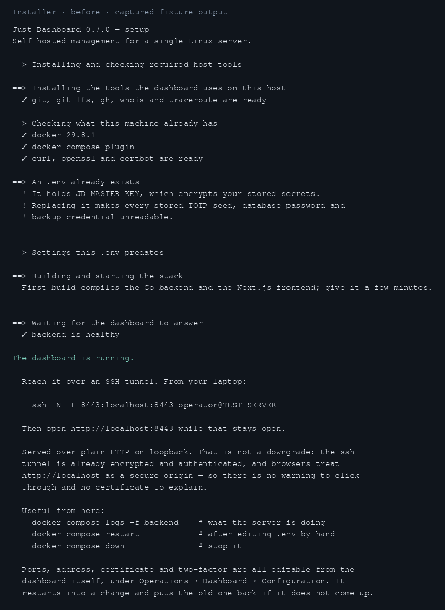
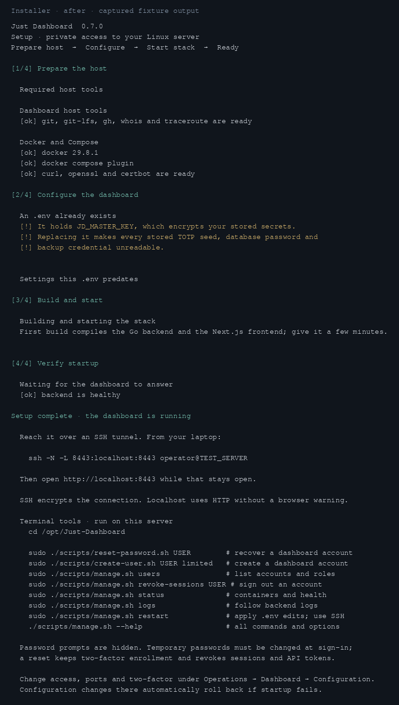

# Terminal tools and installer verification

The installer now presents four labeled stages, shorter access descriptions, plain-output support,
and a completion guide with local account-recovery and stack commands. The terminal scripts create
and list dashboard accounts, reset passwords, revoke browser sessions, show status/logs and recreate
the stack with current settings. See the [operator instructions](../../../README.md#terminal-admin-tools)
and [implementation guide](../../internal/operations/terminal-tools.md).

## Installer output

These previews render captured `NO_COLOR=1` output from the same isolated existing-install fixture in
a monospace terminal layout. Preview colors are applied by the renderer; the accompanying text files
contain the captured plain output. Only the transient checkout path is normalized to
`/opt/Just-Dashboard`. Host tools, Docker/build/start and health responses are fixture commands, so
these captures do not claim a new installation on a live host.

| Before | After |
| --- | --- |
|  |  |

Full transcripts: [before](installer-before.txt), [after](installer-after.txt).

## Validation

- `scripts/test-changed.sh main`: backend build, vet and tests for the changed `admin`, `auth` and
  server packages passed. No frontend source changed.
- `python3 scripts/test_manage.py`: eight fixtures passed, including a real pseudo-terminal check
  for hidden, confirmed password input; stdin/argv handling; root/input gates; directory names with
  spaces; Compose fallback; successful installer completion and build failure.
- `python3 scripts/test_install_dependencies.py`: twelve existing host-tool fixtures passed.
- `python3 scripts/test_dotenv.py`: both existing Compose password-scalar fixtures passed.
- `bash -n install.sh scripts/manage.sh scripts/create-user.sh scripts/reset-password.sh`: passed.
- Focused `go test -race` for `internal/admin` and `internal/auth` passed. Recovery tests verify TOTP
  and recovery-code preservation, session/token revocation and rollback when revocation fails.
- A real Docker/Compose smoke check used the newly built backend binary, an isolated image tag,
  `network_mode: none`, and a temporary database. The host scripts created a limited account, listed
  it, reset its password and revoked its sessions; three successful `cli` audit records were read
  back from SQLite. The binary refused a non-root container user and human account commands in agent
  mode. The fixture image and containers were removed afterwards.

The installed dashboard and its state were untouched. Fresh-host package installation and a live
Tailscale certificate journey were not rerun; their setup decisions were preserved.
