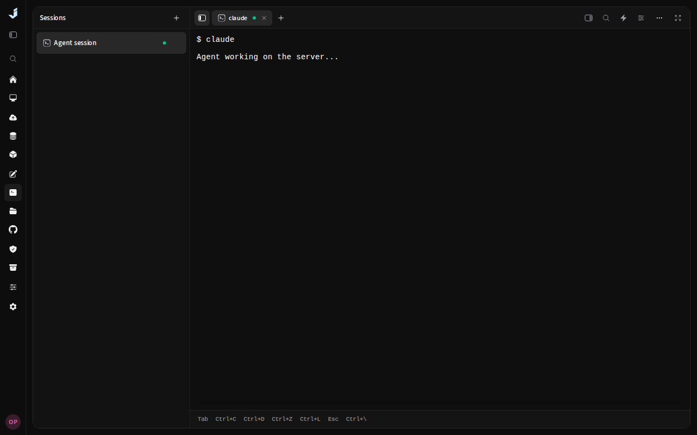
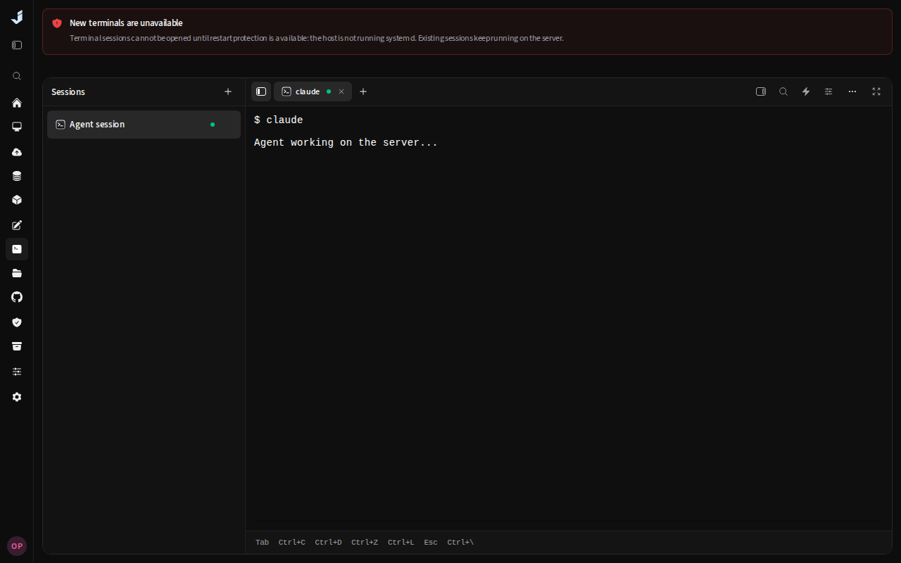

# Terminal lifetime verification

Terminal sessions must keep running with no browser connected and across dashboard restarts,
rebuilds and crashes. New direct terminals now require a host holder; unavailable protection returns
HTTP 503 with a reason. Existing holders are adopted before preparing new ones, and terminal idle
cleanup has been removed. Host reboot and explicitly closing a terminal still end running sessions.

## Local verification

- `bun run build` passed with the production type check enabled.
- `scripts/test-changed.sh patch/0.7.1` passed using this worktree's production frontend at
  `JD_BROWSER_BASE_URL=http://127.0.0.1:43209`: formatting, lint, TypeScript, 1,262 Bun tests, Go build
  and vet, selected Go tests, and 68 browser tests from the terminal and design-system specs.
- Focused Go race tests passed for process exit/recovery, holder setup failure, refusing unprotected
  session/window creation, and work continuing after the last browser disconnects.
- The background-work tests release their work only after the manager has exited or the last browser
  has detached. `scripts/test-changed.sh 627bff87`, focused race tests, and the live systemd tests also
  passed for this deterministic test refinement.
- Live root/systemd tests passed for clean shutdown, forced manager termination, replacing the
  installed holder executable while both windows were running, and adopting a running window when
  preparing new holders fails. The same shell PIDs and workspace/window identities were recovered.
  These tests use temporary state and transient host units; they do not restart the installed dashboard.

To repeat the live tests, build the holder beside a compiled terminal test binary, then run as root:

```bash
terminal_test_dir=$(mktemp -d /tmp/jd-terminal-lifetime.XXXXXX)
cd backend
go build -o "$terminal_test_dir/jd-terminal-holder" ./cmd/terminal-holder
go test -c -o "$terminal_test_dir/term.test" ./internal/term
sudo env JD_TERMINAL_SYSTEMD_LIVE=1 "$terminal_test_dir/term.test" \
  -test.run='^Test(HeldWindowsSurviveManagerProcessExit|HolderSetupFailureStillAdoptsRunningWindows)$' \
  -test.v
```

The live test replaces the executable using the production atomic installer. It does not perform a
Docker Compose rebuild of the dashboard stack. Linux host reboot survival is outside the terminal
contract. No CI changes were made.

## UI evidence

These screenshots use a mocked holder setup failure and a terminal that was already running.
The before image uses the previous API response shape in the current build; the active workspace
layout is unchanged. The after image includes the new reason and keeps the same terminal visible.

| Before: failure is silent | After: failure is explained, existing work remains accessible |
| --- | --- |
|  |  |
