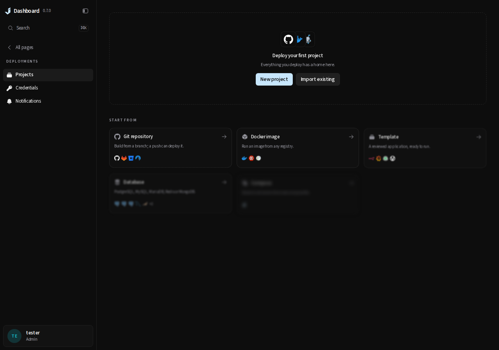
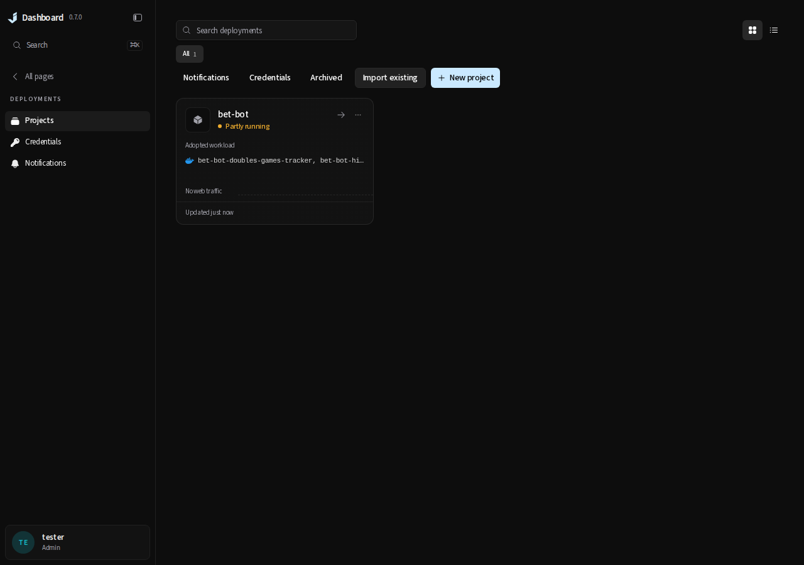
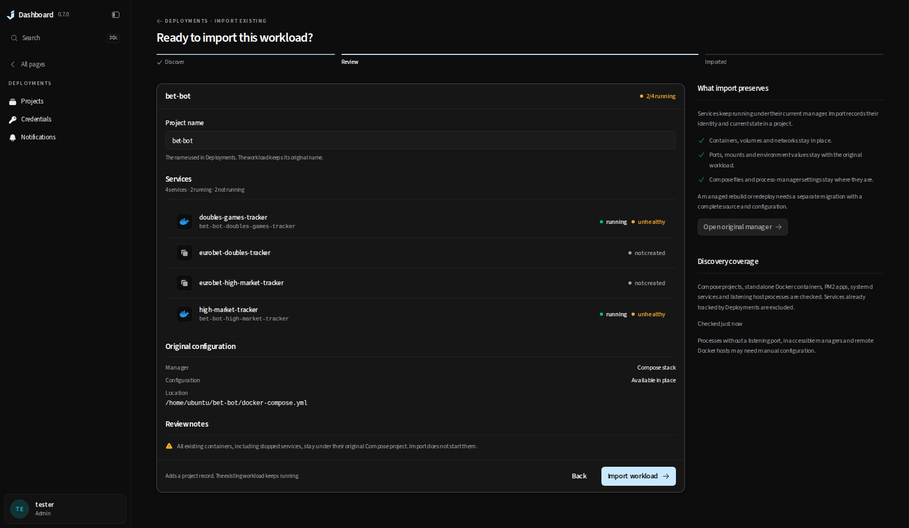
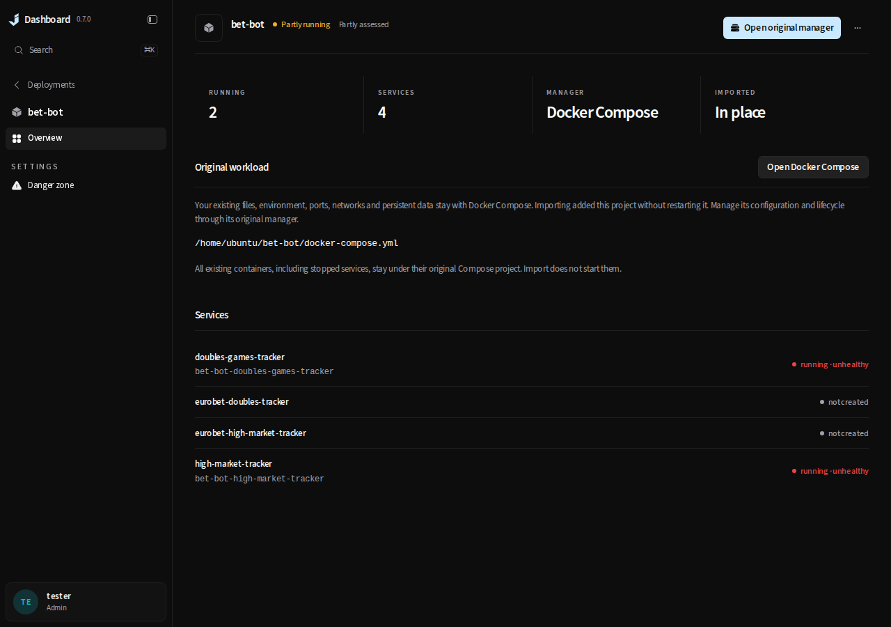

> This record describes the earlier observation-only implementation. It is retained for provenance;
> it does not verify the managed adoption implemented by the current task branch. See [current acceptance](README.md).

# Historical observation-only import acceptance

Date: 2026-10-04. Task branch: `feature/import-existing-workloads`, targeting `patch/0.7.1`.

## Historical decision and scope

Deployments can discover and register existing applications in place, after the administrator
reviews one. Docker Compose, standalone Docker, existing default-home PM2 daemons, systemd system
services and listening host processes supply identities. Registration preserves configuration by
leaving it with the existing manager. It does not reconstruct or transfer a build/restart recipe.

This distinction matters for n8n and other stateful applications: copying a container's visible
settings does not recover launch-time interpolation, secret files, container-layer data, shared
volumes, dependencies, proxy routing or boot behavior. The implementation deliberately creates no
runtime, release, copied variable, watcher or schedule. Backend guards keep external runtime imports
out of execution, configuration conversion, duplication and automation. Legacy checkout imports
retain their existing behavior. See [the contract and upstream research](../../internal/deployments/existing-workloads.md).

## Native bet-bot proof

The browser used real authenticated API routes, a temporary database, the host Docker socket and
the existing bet-bot stack. It did not intercept discovery/import responses, change the installed
dashboard's database or restart any existing application. The temporary server did not start the
deployment engine or background reconciler.

Bet-bot's Compose file declares four services. At verification time two containers existed and were
running; the other two declared services had no containers. Both running containers already reported
unhealthy. Import retained those facts: running is not presented as a successful health check, and
missing containers appear as **not created**, rather than stopped.

Before and after import, each existing container's full ID, `StartedAt`, restart count and SHA-256
of its Config, HostConfig, mounts and network attachments matched. The native test passed in 9.8s.
The saved JSON contains configuration hashes, not configuration values or credentials.

| Before | After |
| --- | --- |
|  |  |





- [Discovery at 1280px](native-discovery-1280.png)
- [Review at 1280px](native-review-1280.png)
- [Native interaction recording](native-import.webm)
- [Bet-bot continuity evidence](native-continuity.json)

## Owned live Docker fixture

A second acceptance test created only a uniquely named test project: four containers, two running
and two stopped, a loopback HTTP listener, a bind-mounted source directory, an environment value,
restart policies and a persistent named volume. The test imported it through authenticated API
routes into a temporary database and then removed its own containers, network and volume.

The integrated-tree run passed in 15.04s. Container IDs, configuration, mounts, networks, ports,
PIDs, start times and restart counters matched before and after. The Compose source and named-volume
bytes matched. Six HTTP checks during import had zero failures; no deployment run, release or
variable record was created. [Sanitized live fixture evidence](live-workload-import.json).

## Cases covered

| Case | Result and verification |
| --- | --- |
| Compose with running and stopped containers | All containers stay together; live four-container fixture and browser fixture. |
| Declared missing Compose service | Listed as not created; native bet-bot proof and grouping regression. |
| Multiple replicas of a service | Counts container instances plus missing declarations; grouping regression. |
| Multiple Compose files or inaccessible source | Original files stay in place; sanitized warning and observation remain available. Static parsing is not a full Compose renderer. |
| Standalone Docker app, including n8n shape | Full container identity; no image, environment, mount or network copying; route/discovery fixtures. |
| Unpublished ports in arbitrary Docker order | Canonical port ordering keeps review digest stable; regression and real Caddy fixture. |
| Changed identity, topology or source availability after review | Registration re-inspects and refuses a stale digest; API and browser retry tests. |
| Concurrent/repeated import or duplicate name | Atomic registration; exact repeat returns existing IDs, another name/resource is refused. Store tests. |
| A stack and its container imported separately | Member-ID overlap is fenced in both orders; store tests. |
| Archived import | Ownership remains reserved until permanent record deletion; external resources remain observed. Store lifecycle tests. |
| PM2 cluster and duplicate names across accounts/namespaces | Grouped within account and namespace only; parser/discovery tests. |
| PM2 daemon absent or incompatible | No CLI/API daemon-start path; existing-socket transport tests and partial-account failure reporting. |
| systemd inactive unit or listening service | System unit identity retained; no rewrite/reload and no duplicate listener candidate. Discovery tests. |
| Bare Next/React/Vue/Node listener, including IPv6 | Framework-independent PID plus creation time; multiple sockets grouped and ports formatted. Discovery and browser tests. |
| PID reuse or replaced Docker container | Old observation is not silently rebound; identity/digest tests. |
| Manager failure or removed app after import | Retained inventory marked Not observed, rather than stopped/healthy; backend and UI tests. |
| Dashboard, ingress or dashboard-managed workload | Excluded from import candidates; self-exclusion tests. |
| Viewer, API token, unauthenticated request or missing CSRF header | Import routes require an administrator session; focused route tests verify each refusal. |
| Execution/configuration requests against observed import | Backend refuses lifecycle enqueue, source/config conversion and duplication; focused API/store tests. |
| Schedule command, backup chain or provider delivery for observed import | Schedule/trigger creation and updates are refused; dispatch is fenced before Docker exec, feature-owner work or preview creation. API tests verify zero Docker mutations, no run and no preview. Legacy checkout automation remains accepted. |
| Legacy full update, signed retained hook, rollback or old run retry | Ownership is checked before update/queue admission; API tests prove zero new runs. Project rename and existing-checkout compatibility remain available. |
| Old import link, incomplete saved draft or remembered external setup | Links and an explicit preserved-draft bridge lead to discovery before configuration/detection. Six browser compatibility cases also verify checkout adoption still works. |

Additional Docker daemons, rootless Docker, Podman, custom PM2_HOME locations, user systemd managers
and unmanaged workers without listening sockets are not enumerated. Source files can be incomplete
or unavailable. No test claims automatic conversion into a dashboard-managed deployment. Full
migration needs an authoritative source/configuration and an explicit ownership-transfer plan.

## Reproduction

Final integrated verification passed:

- `scripts/test-changed.sh patch/0.7.1` with `JD_BROWSER_BASE_URL=http://127.0.0.1:43127`:
  Prettier, ESLint, TypeScript, 2,936 Bun tests, backend build/vet and selected API/procs/deploy tests.
  The browser selection passed 601 tests in 10.3 minutes; its one opt-in native spec was skipped
  there and passed separately against the real existing stack as described above.
- Production `JD_API_URL=http://127.0.0.1:44119 bun run build`: passed, including its TypeScript gate.
- Focused race run on API/deploy/procs for imported reads, workload discovery/registration,
  observed-import guards, existing PM2 and automation: passed (33.301s / 67.329s / 6.743s).
- The subsequent legacy full-update/hook/rollback/retry guard cases passed their focused race run
  (9.496s) and are included in the final selective normal run.
- The 1280×900 native WebM recording loaded and played in Chromium (10.24 seconds).

Documentation review covered `docs/internal/`, `AGENTS.md`, `README.md` and `CONTRIBUTING.md`.
The behavior, ownership limits, frontend routes/state, PM2 reader, repository map and reproduction
commands are updated. `AGENTS.md` needs no change because the contributor workflow is unchanged.
No CI, dependency, licensing, schema migration or release-note changes are part of this feature.

Run normal selective verification from the task worktree against the active release branch:

```bash
JD_BROWSER_BASE_URL=http://127.0.0.1:43127 scripts/test-changed.sh patch/0.7.1
```

The live fixture requires the locally available `caddy:2-alpine` image and a working Docker socket:

```bash
cd backend
JD_WORKLOAD_IMPORT_LIVE=1 JD_WORKLOAD_IMPORT_EVIDENCE_DIR=/tmp/jd-import-live-proof \
  go test ./internal/api -run '^TestLiveWorkloadImportKeepsFourContainerStackAndHTTPServiceUnchanged$' -count=1 -v
```

The opt-in native browser spec targets the existing `bet-bot` Compose project on this host. Start its
isolated authenticated server in one terminal and leave it running:

```bash
cd backend
JD_IMPORT_BROWSER_EVIDENCE_DIR=/tmp/jd-import-browser-proof \
  go test ./internal/api -run '^TestWorkloadImportBrowserEvidenceServer$' -count=1 -v -timeout=20m
```

Build and serve this worktree's frontend in another terminal, using the evidence API's loopback port:

```bash
cd frontend
JD_API_URL=http://127.0.0.1:44119 bun run build
bun run start --hostname 127.0.0.1 --port 43127
```

Then record the journey and stop the temporary API server:

```bash
cd frontend
JD_BROWSER_BASE_URL=http://127.0.0.1:43127 \
  JD_IMPORT_NATIVE_READY=/tmp/jd-import-browser-proof/ready.json \
  JD_IMPORT_NATIVE_EVIDENCE=/tmp/jd-import-browser-recording \
  bunx playwright test tests/browser/workload-import-native.spec.ts --workers=1
touch /tmp/jd-import-browser-proof/stop
```

`ready.json` contains the temporary test session and must stay private; it is not an evidence artifact.
The server has a fifteen-minute stop deadline. Ordinary selective browser runs skip this opt-in spec.
