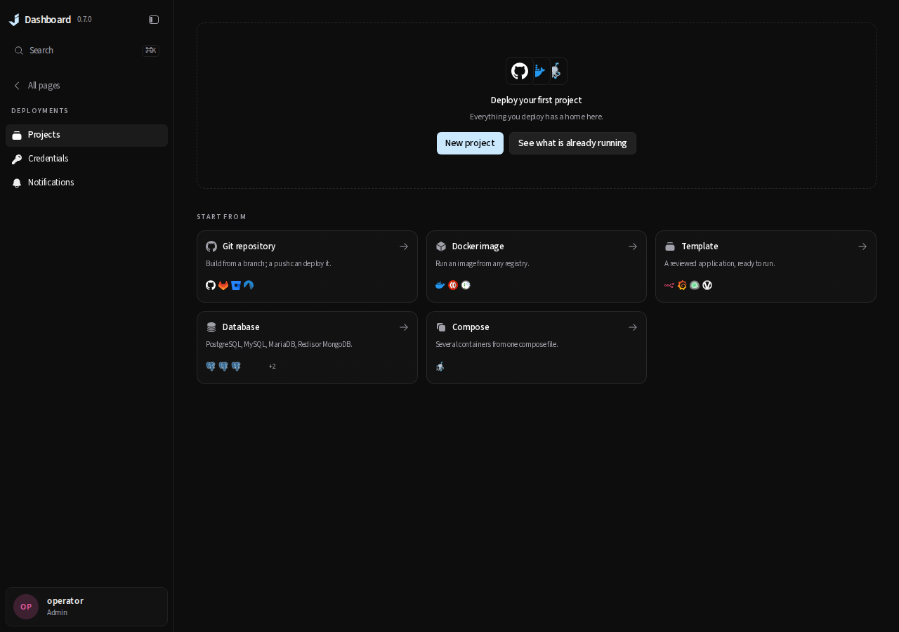

# Remove existing-workload deployment import

This change reverts merge PR #145, then #136, from `patch/0.7.1`. Later deployment
creation, run-page and runtime-page redesigns are retained when resolving conflicts.
The repository history is preserved; no deployed workload or installed database is modified by Git.

## Compatibility retained

- Keep the additive `adoption_enc` and `value_mode` migrations and value-mode immutability trigger.
- Preserve stored literal/reference interpretation and release variable snapshot digests.
- Refuse mutations and execution for previously adopted projects and legacy external observations.
  Already queued runs fail with `import_removed` before executing a step. Provider deliveries and
  schedules are refused before their feature-owner side effects.
- Keep imported review records, but refuse edits or commit through the ordinary draft flow.
- Keep older Git-checkout import APIs; refuse container and Compose workload imports.
- Keep independent verification corrections for consumed SQL handoffs, the notification clock and
  typed runtime failure causes. Reverting those assertions would test superseded behavior.

Stop or drain active deployment runs before switching versions. Manage an imported application's
runtime with its original tools, or restore an import-capable version. The retired project's
records are retained; this change does not reconstruct native startup authority or migrate it back.

## UI evidence

The screenshot uses the browser suite's **mocked API**, served by this worktree's production build.
It verifies that the fleet no longer offers **Import existing** and points **See what is already
running** to Docker stacks. It is not live-server adoption evidence.

## Verification

Run `scripts/test-changed.sh patch/0.7.1` against a production frontend built from this tree.
Additional live acceptance uses isolated Docker fixtures:

- `python3 scripts/e2e-deployments.py`
- `JD_DEPLOY_LIVE=1 go test ./internal/proxysvc -run '^TestLiveCutover(TrafficContinuity|SurvivesProxyLoss)$' -count=1 -v`
- `JD_DEPLOY_LIVE=1 go test ./internal/deploy -run '^(TestLiveRuntimeLossKeepsExactlyOneReleaseLive|TestLiveBackendKillAtEveryStepLeavesOneRecoveredRun)$' -count=1 -v`
- `JD_DEPLOY_LIVE=1 go test ./internal/deploy -run '^TestLiveC4ArtifactAdapters$' -count=1 -v`
- `JD_DEPLOY_LIVE=1 go test ./internal/deploy -run '^TestLiveDetectedFrameworkBuildAndServing$' -count=1 -v`

The PR records the completed check results and limits. Retirement tests cover read-only records,
import-review refusal, endpoint boundaries, queued execution without steps and literal values that
look like references; focused deployment and API tests also run with the race detector.
