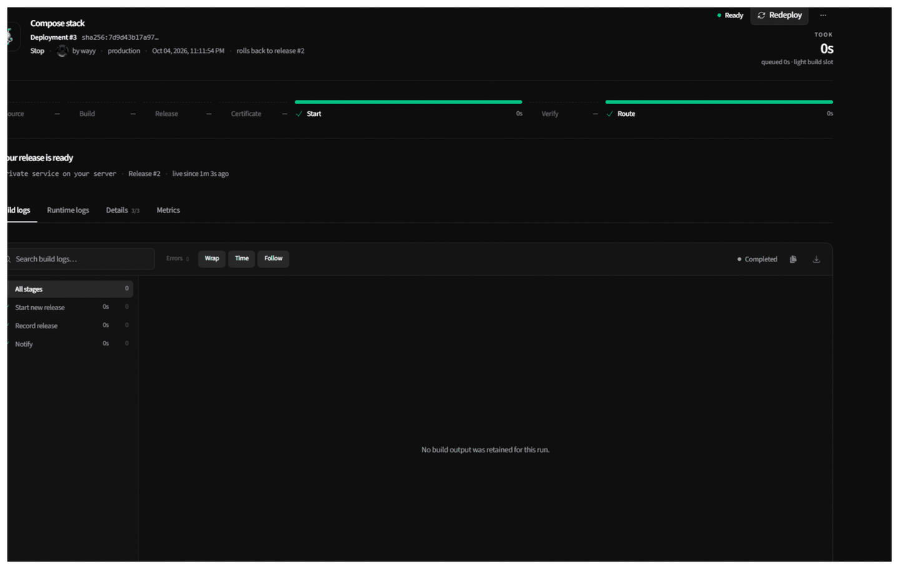
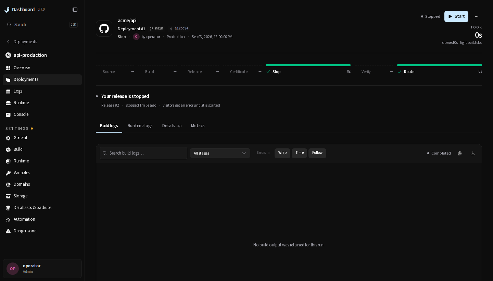
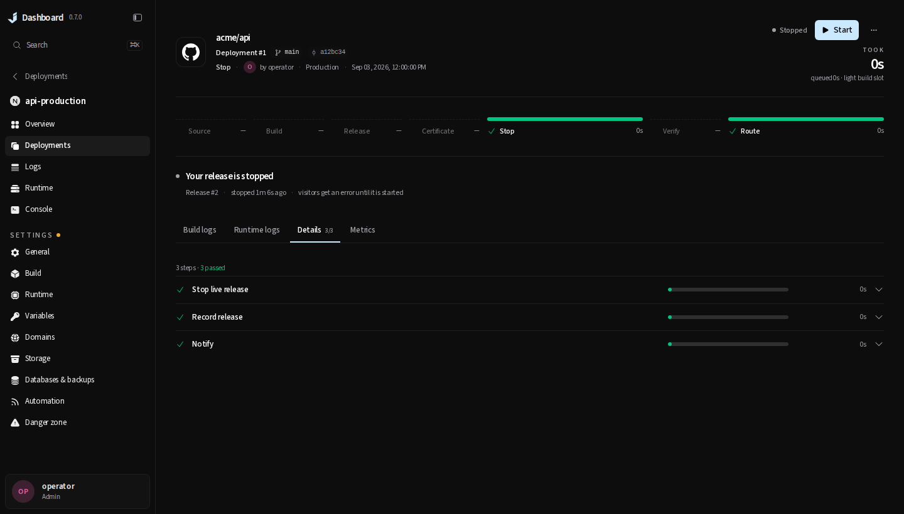

# A Stop's run page

Pressing Stop opens the run it started, as every project verb does. That page drew a Stop like a
deploy that went live: *Ready*, a lit Start stage with a *Start new release* step, "Your release is
ready" with the address, Redeploy, "rolls back to release #2" (the Stop's `targetReleaseId` is the
live release it acts on), and confetti if the reader watched it finish.

It now reads as the runtime it left: *Stopped*, a Stop stage whose step is *Stop live release*, "Your
release is stopped" with when and what it means for visitors, and Start beside the state. Once a newer
run has started the release again the outcome says so, and Start goes away.

The screenshots are this branch's production build at 1440×820 against the labelled API fixtures of
`frontend/tests/browser/deploy-run.spec.ts`, whose "a Stop that succeeded reads as stopped…" scenario
asserts the same page and the Start request; the "before" is the operator's own capture of a Compose
stack's Stop. The contract is in
[`docs/internal/deployments/implementation.md`](../../internal/deployments/implementation.md).
