# Command palette overhaul

## Why

The Ctrl/Cmd+K menu was correct and read as generated. Every row was two lines on a 32px tile
tinted in one of seven `--tag-*` hues, the same hue dotted the group heading in tracked capitals, and
fourteen scope chips each led with a glyph in its own colour. A column of faded squares is the icon
plate §14 of the design system removed from every other surface, and it said nothing the heading
above it had not. Nothing on the menu answered the arrows except a grey band: walking fifty results
read a column of names and nothing about what they were.

## What changed

- **One line per result.** Mark, name, second line in the hint size, then the state, when it was
  visited, *Previous*, *Current* or the shortcut. A screen holds about twice the rows.
- **No hue tiles.** A product is its own logo bare; anything else is its rail glyph, grey at rest and
  ink when selected. The colour in the list is the products' own. Group headings are plain words with
  a count while typing.
- **Scopes as words.** The Files search's underlined strip (`tabClasses`) replaces the chips; counts
  stay, dimmed when a scope has no matches.
- **A preview beside the list (`lg` and wider).** It follows the selection: the product tile, the
  kind, name and state, then what the row has no room for — a container's image, status, health and
  Compose service; a site's server and every domain; a database's engine, host and protection; a
  repository's branch, folder, last commit and working tree; a backup's destination, schedule and
  folders. A page shows the rail list it sits in; a command says what it does.
- **Connected resources.** Inventory rows name exact links — domains, container names, stacks,
  folders — and the preview lists resources sharing one: the site serving a project's domain, the
  container a connection's host names, the stack and backup in a repository's folder. They open on a
  click. No relation is guessed.
- **Recent places look like where they were.** A recent row is the rail entry or the resource it was
  opened as, with how long ago; going back to a resource shows its current readings.
- **Motion that says something.** The preview's body and rows that arrive as the words change take
  `animate-rise`; inventory loading shimmers the footer's *Loading …* line. The list and preview hold
  one height while typing.

The index, ranking, scopes, keyboard model, permissions and inventory reads are unchanged. The new
facts and links come from the same explicitly selected fields; database users, backup target paths,
remotes, environments and notes stay out, which the inventory test's secret check covers.

## Screenshots

Production build of this branch against the labelled API fixtures in
`tests/browser/command-search-fixture.ts` (with four extra containers), 1440 × 900 unless noted.

| | Before | After |
| --- | --- | --- |
| Opened with no search | 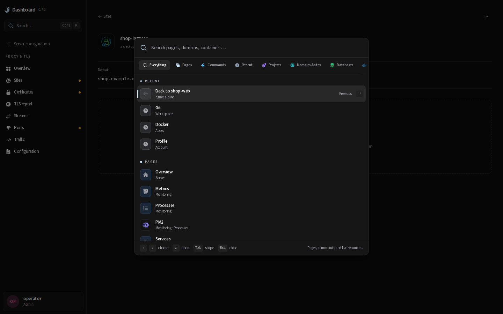 | 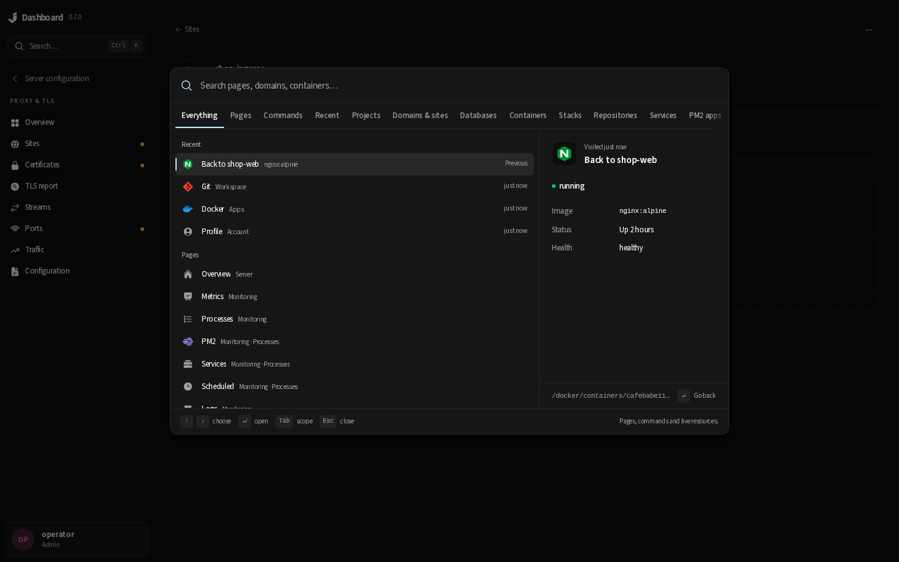 |
| `shop` across every kind | 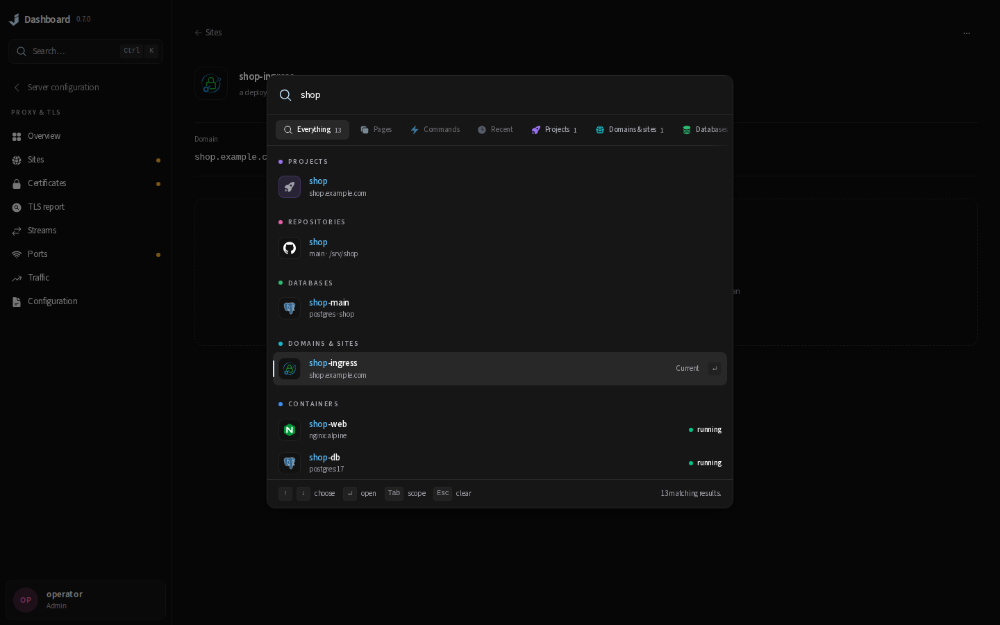 | 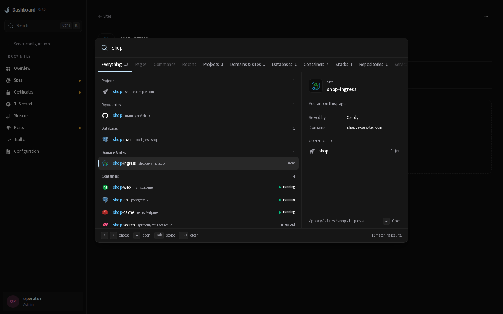 |
| `container:` scope | 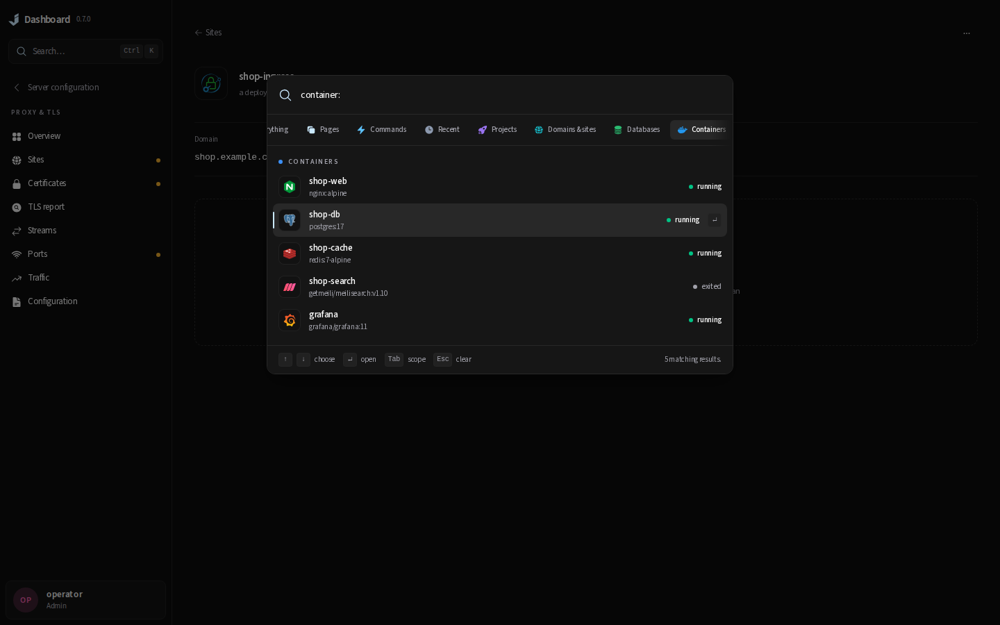 | 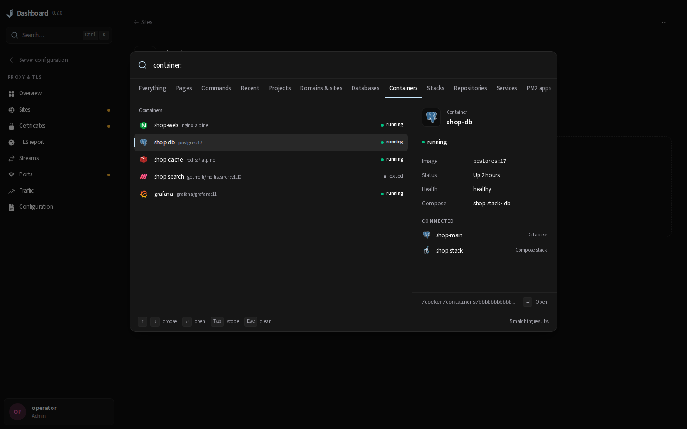 |
| Pages for `proc` | 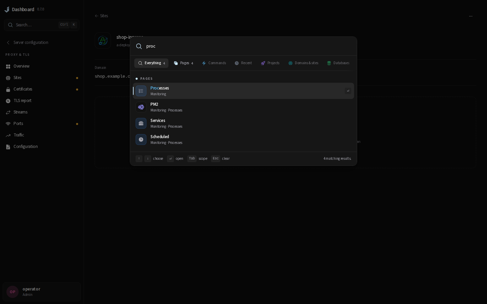 | 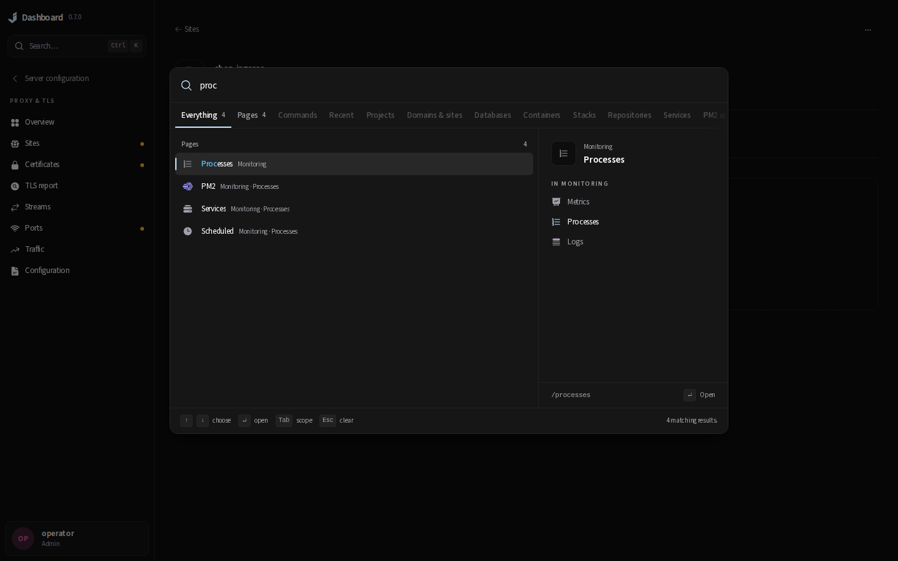 |
| Phone, 390 × 844 | 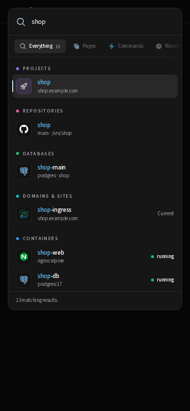 | 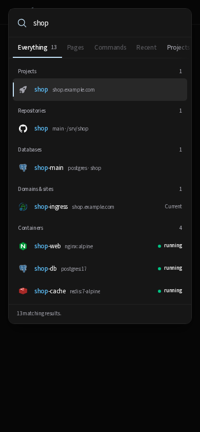 |

A repository and what shares its folder: 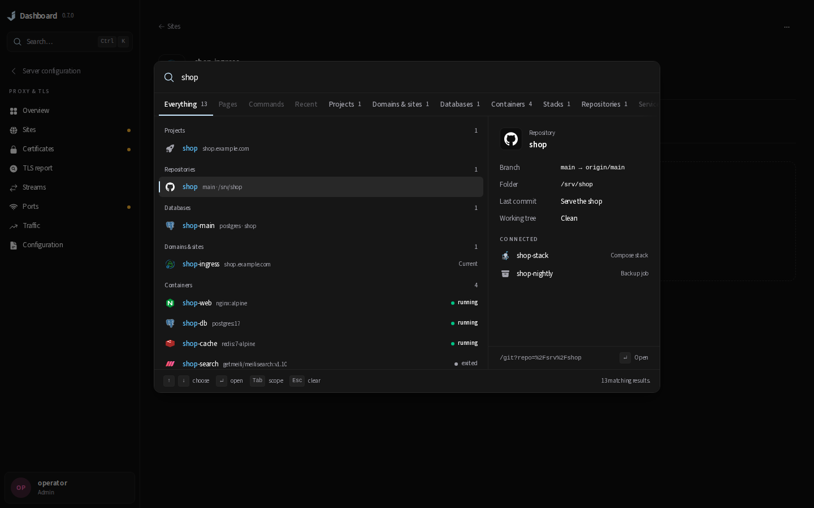

## Verification

Production build of this branch, served with
`bun run start --hostname 127.0.0.1 --port 43181`.

- `cd frontend && bun run build` — passed.
- `JD_BROWSER_BASE_URL=http://127.0.0.1:43181 scripts/test-changed.sh patch/0.7.1` — Prettier, ESLint,
  `tsc --noEmit` and 2,985 Bun tests passed; 548 of the 550 browser cases the gate picked passed. The
  two that timed out at 30 s under load — `proxy-sites-list.spec.ts:1266` and `proxy-ui.spec.ts:261`
  at 1280 — passed on rerun against this build, and the proxy one also passes against a build of the
  base branch. Neither renders the palette.
- `bunx playwright test tests/browser/command-search.spec.ts tests/browser/design-system.spec.ts
  tests/browser/navigation.spec.ts` on the final build — 95 passed, including the new preview
  scenario (facts follow the selection, connected resources open on a click and stay out of the tab
  order, a page's rail list, no mutations) and the phone check that the preview is hidden.
- `bun test src/components/command-search` — the new links and facts test beside the existing ones,
  with the secret-exclusion test covering the new fields.
